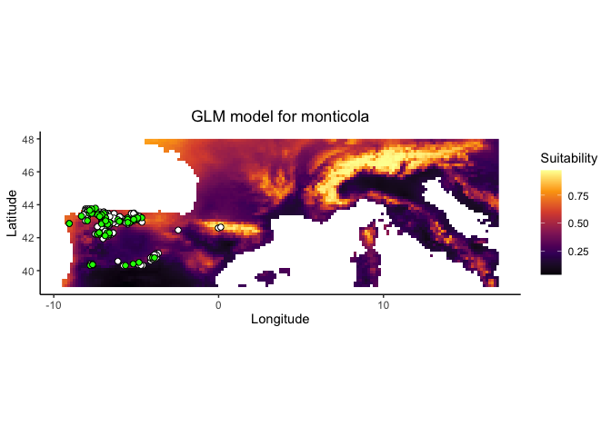
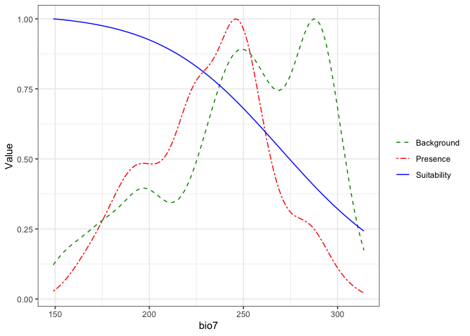
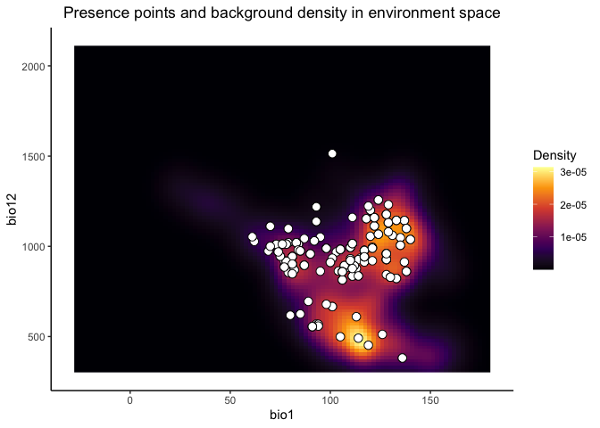
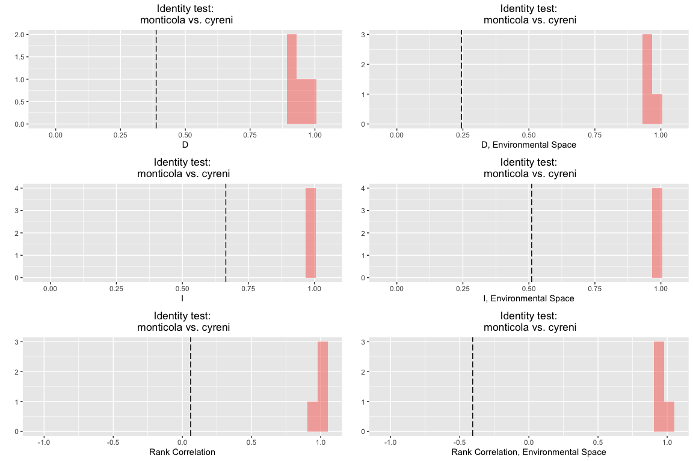
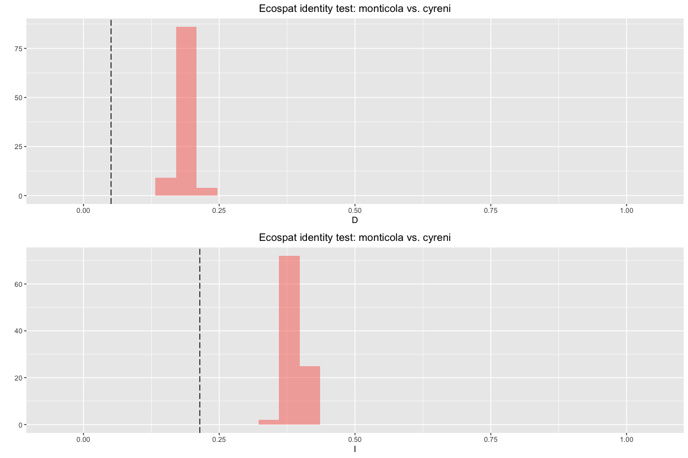
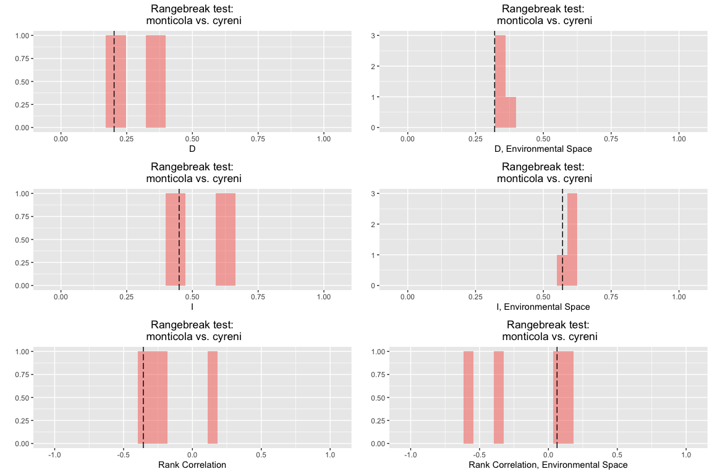
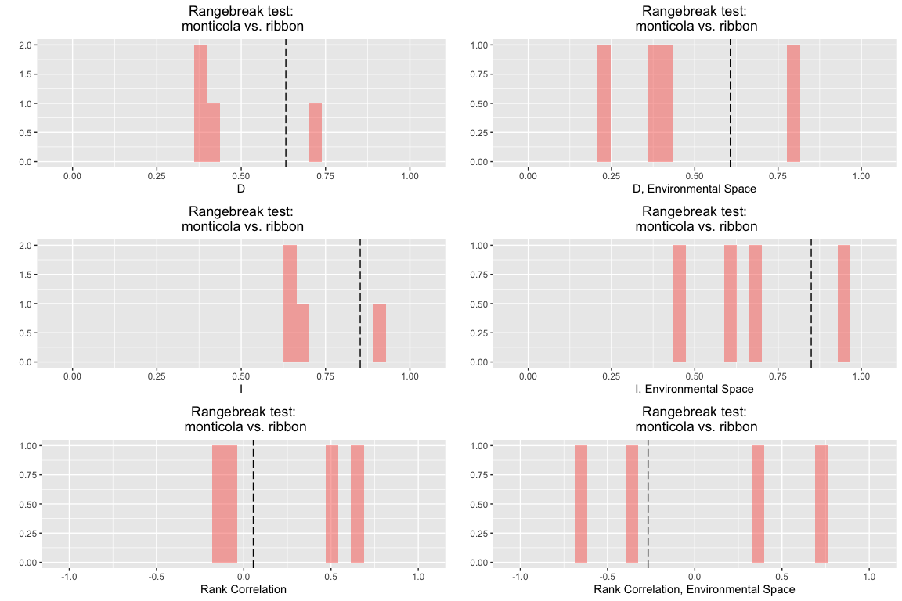
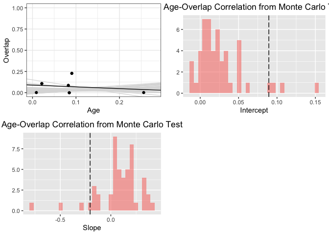

# ENMTools

This package implements various tests, visualizations, and metrics for
use with environmental niche models (ENMs) and species distribution
models (SDMs).

### Citation

Warren, D.L., Matzke, N.J., Cardillo, M., Baumgartner, J.B., Beaumont,
L.J., Turelli, M., Glor, R.E., Huron, N.A., Simões, M., Iglesias, T.L.
and Piquet, J.C., 2021. ENMTools 1.0: an R package for comparative
ecological biogeography. Ecography, 44(4), pp.504-511.

-----

# Installation

ENMTools is available on CRAN, and can be installed by simply typing:

``` r
install.packages("ENMTools")
```

You can also install the newest version from
<https://github.com/danlwarren/ENMTools>. There are multiple ways to
download it. The easiest is to use devtools and install from GitHub.

### Installing from GitHub using devtools

Run the following code from your R console:

``` r
install.packages("devtools")
library(devtools)
install_github("danlwarren/ENMTools")
library(ENMTools)
```

If you want the absolute newest version you’ll want to install from the
“develop” branch, but be aware that sometimes things get broken on
there and it may take us a little while to notice.

``` r
install_github("danlwarren/ENMTools", ref = "develop")
library(ENMTools)
```

### Install from zip file

A zipped version of the package is available at
<https://github.com/danlwarren/ENMTools/archive/master.zip>. To install
from the zip file, download a copy of it to your system. Once it’s
finished downloading, type the following (where PATH is the path to the
zip file):

``` r
install.packages("devtools")
library(devtools)
install_local("PATH")
library(ENMTools)
```

### Installing extras

ENMTools uses functionality from a *LOT* of other R packages, and it’s
possible that you don’t want to install them all. For that reason many
of the packages are not automatically installed with ENMTools, but
instead “suggested”. If you want to install all of the suggested
packages, we have a function for that. You should only need to use it
after you first install ENMTools or update R. If you choose not to
install the extra packages, you will get warnings when you try to use
functions that require them.

``` r
install.extras()
```

-----

# Interacting with ENMTools

### Creating enmtools.species objects

We’re going to load in some environmental data. You can do this from
local rasters, like so:

``` r
env.files <- list.files(path = "./env_pca/", pattern = "pc", full.names = TRUE)
env <- stack(env.files)
names(env) <- c("pc1", "pc2", "pc3", "pc4")
env <- setMinMax(env)
```

Or you can load them from the internet using the raster package’s
getData() function.

``` r
library(raster)
env <- raster::getData('worldclim', var='bio', res=10)
env <- crop(env, extent(-10, 17, 39, 48))
plot(env[[1]])
```

<!-- -->

Regardless of where you get your environmental data from, it’s a good
idea to call the check.env() function on it. This makes sure that an NA
in an environmental layer propagates to the other layers, which can
avoid issues with some of the modeling functions.

``` r
env <- check.env(env)
```

ENMTools is primarily designed to examine patterns of similarity and
difference between ENMs for different species. In order to simplify
interactions with the functions in ENMTools, you need to put your data
for each of your species into an enmtools.species object. You can create
and view an empty enmtools.species object just by typing:

``` r
monticola <- enmtools.species()
monticola
```

    ## 
    ## 
    ## Range raster not defined.
    ## 
    ## Presence points not defined.
    ## 
    ## Background points not defined.
    ## 
    ## Species name not defined.

You can add bits of it when the object is created:

``` r
monticola.path <- paste(system.file(package="ENMTools"), "/monticola.csv", sep='')
monticola <- enmtools.species(species.name = "monticola", 
                            presence.points = read.csv(monticola.path))
monticola$range <- background.raster.buffer(monticola$presence.points, 50000, mask = env)
monticola$background.points <- background.points.buffer(points = monticola$presence.points,
                                                   radius = 20000, n = 1000, mask = env[[1]])
```

Or you can add data to this object after it’s created:

``` r
names(monticola)
monticola$species.name <- "monticola"
monticola$presence.points <- read.csv(monticola.path)
monticola$range <- background.raster.buffer(monticola$presence.points, 50000, mask = env)
monticola$background.points <- background.points.buffer(points = monticola$presence.points,
                                                   radius = 20000, n = 1000, mask = env[[1]])
```

It’s always a very good idea to run the check.species() function on an
enmtools.species object after you build or modify it.

``` r
monticola <- check.species(monticola)
```

And now we can take a look at our species\!

``` r
interactive.plot.enmtools.species(monticola)
```

<!-- -->

However, ENMTools also contains some sample data. It contains an
enmtools.clade object called “iberolacerta.clade”, which holds several
enmtools.species objects including an already-built version of
Iberolacerta monticola. It also has some low-resolution Worldclim data
that we can use to demonstrate functions. We’ll pull two of those
species out now.

``` r
data(iberolacerta.clade)
data(euro.worldclim)
monticola <- iberolacerta.clade$species$monticola
cyreni <- iberolacerta.clade$species$cyreni
env <- euro.worldclim
```

## Building an ENM

ENMTools contains functions to simplify the ENM construction process.
Using enmtools.species objects and the correct modeling commands, we can
build models very quickly. These commands are primarily wrappers to
dismo model construction and projection functions, and at present are
only available for GLM, Maxent, Domain, and Bioclim models. One of the
nice bits about this setup is that it allows enmtools to automatically
generate suitability maps, do model evaluation, and plot the marginal
suitability of habitat for each variable separately.

Before we get started modeling, however, we might want to trim our
predictor set so as to reduce collinearity. ENMTools contains a couple
of handy functions for this.

``` r
raster.cor.matrix(env)
```

    ##              bio1         bio2        bio3        bio4       bio5        bio6
    ## bio1   1.00000000  0.208715969  0.36766171 -0.21357041  0.8853513  0.93295069
    ## bio2   0.20871597  1.000000000  0.58362743  0.30918934  0.5417192 -0.01723188
    ## bio3   0.36766171  0.583627431  1.00000000 -0.56601419  0.3052211  0.42521254
    ## bio4  -0.21357041  0.309189341 -0.56601419  1.00000000  0.1754180 -0.52131150
    ## bio5   0.88535133  0.541719174  0.30522110  0.17541802  1.0000000  0.68751772
    ## bio6   0.93295069 -0.017231880  0.42521254 -0.52131150  0.6875177  1.00000000
    ## bio7  -0.05329392  0.709020870 -0.14900115  0.87998888  0.4016817 -0.38884596
    ## bio8   0.24945265  0.068562982 -0.16262988  0.30400935  0.2862188  0.09285337
    ## bio9   0.73849291  0.183148800  0.42195497 -0.37866158  0.6400464  0.77343845
    ## bio10  0.96045067  0.311324869  0.21975162  0.06247355  0.9606340  0.80726704
    ## bio11  0.95921479  0.101719882  0.48107648 -0.47305206  0.7533941  0.98896057
    ## bio12 -0.60846674 -0.482731496 -0.31488066 -0.07961919 -0.7137513 -0.48704454
    ## bio13 -0.41433559 -0.510317568 -0.25626002 -0.19124801 -0.5722885 -0.28138429
    ## bio14 -0.72871981 -0.338229901 -0.37618609  0.16712793 -0.7297745 -0.67564389
    ## bio15  0.45421260 -0.007931916  0.11838593 -0.21759678  0.3821863  0.47445069
    ## bio16 -0.44597594 -0.506032477 -0.26995545 -0.16924912 -0.5920746 -0.31485467
    ## bio17 -0.70338945 -0.343806007 -0.33935275  0.10832583 -0.7243068 -0.63769389
    ## bio18 -0.81091065 -0.331213024 -0.47078459  0.28348226 -0.7776879 -0.80126262
    ## bio19 -0.12414066 -0.396445432  0.07348362 -0.48121938 -0.3430162  0.07715578
    ##              bio7        bio8       bio9       bio10       bio11       bio12
    ## bio1  -0.05329392  0.24945265  0.7384929  0.96045067  0.95921479 -0.60846674
    ## bio2   0.70902087  0.06856298  0.1831488  0.31132487  0.10171988 -0.48273150
    ## bio3  -0.14900115 -0.16262988  0.4219550  0.21975162  0.48107648 -0.31488066
    ## bio4   0.87998888  0.30400935 -0.3786616  0.06247355 -0.47305206 -0.07961919
    ## bio5   0.40168174  0.28621877  0.6400464  0.96063401  0.75339408 -0.71375135
    ## bio6  -0.38884596  0.09285337  0.7734384  0.80726704  0.98896057 -0.48704454
    ## bio7   1.00000000  0.24603268 -0.1633540  0.20071994 -0.29134540 -0.29133189
    ## bio8   0.24603268  1.00000000 -0.2200483  0.33135353  0.12985480 -0.30622476
    ## bio9  -0.16335400 -0.22004834  1.0000000  0.66175815  0.78861884 -0.46297347
    ## bio10  0.20071994  0.33135353  0.6617581  1.00000000  0.84907884 -0.65829840
    ## bio11 -0.29134540  0.12985480  0.7886188  0.84907884  1.00000000 -0.54163405
    ## bio12 -0.29133189 -0.30622476 -0.4629735 -0.65829840 -0.54163405  1.00000000
    ## bio13 -0.37121605 -0.19351156 -0.3074562 -0.48860809 -0.32972845  0.90648180
    ## bio14 -0.07381576 -0.25699492 -0.6265099 -0.71411350 -0.72423144  0.77619752
    ## bio15 -0.11344874  0.17648853  0.3970693  0.41693023  0.49288586 -0.24313910
    ## bio16 -0.35410914 -0.21747973 -0.3274923 -0.51511693 -0.36513899  0.91789736
    ## bio17 -0.11473790 -0.30488093 -0.5552129 -0.70368996 -0.68356379  0.80791339
    ## bio18  0.02381502  0.03291308 -0.8163353 -0.76592247 -0.82992875  0.76402046
    ## bio19 -0.53249335 -0.51356967  0.1072073 -0.26914814  0.01511498  0.74717071
    ##            bio13       bio14        bio15      bio16      bio17       bio18
    ## bio1  -0.4143356 -0.72871981  0.454212596 -0.4459759 -0.7033895 -0.81091065
    ## bio2  -0.5103176 -0.33822990 -0.007931916 -0.5060325 -0.3438060 -0.33121302
    ## bio3  -0.2562600 -0.37618609  0.118385927 -0.2699555 -0.3393528 -0.47078459
    ## bio4  -0.1912480  0.16712793 -0.217596785 -0.1692491  0.1083258  0.28348226
    ## bio5  -0.5722885 -0.72977455  0.382186338 -0.5920746 -0.7243068 -0.77768793
    ## bio6  -0.2813843 -0.67564389  0.474450688 -0.3148547 -0.6376939 -0.80126262
    ## bio7  -0.3712161 -0.07381576 -0.113448735 -0.3541091 -0.1147379  0.02381502
    ## bio8  -0.1935116 -0.25699492  0.176488534 -0.2174797 -0.3048809  0.03291308
    ## bio9  -0.3074562 -0.62650986  0.397069264 -0.3274923 -0.5552129 -0.81633533
    ## bio10 -0.4886081 -0.71411350  0.416930231 -0.5151169 -0.7036900 -0.76592247
    ## bio11 -0.3297284 -0.72423144  0.492885864 -0.3651390 -0.6835638 -0.82992875
    ## bio12  0.9064818  0.77619752 -0.243139096  0.9178974  0.8079134  0.76402046
    ## bio13  1.0000000  0.48404051  0.130409758  0.9902335  0.5245850  0.58835234
    ## bio14  0.4840405  1.00000000 -0.743674332  0.5012004  0.9859234  0.84673991
    ## bio15  0.1304098 -0.74367433  1.000000000  0.1244492 -0.7294802 -0.46226779
    ## bio16  0.9902335  0.50120043  0.124449153  1.0000000  0.5362200  0.61586400
    ## bio17  0.5245850  0.98592339 -0.729480228  0.5362200  1.0000000  0.81764699
    ## bio18  0.5883523  0.84673991 -0.462267795  0.6158640  0.8176470  1.00000000
    ## bio19  0.7906993  0.31690226  0.128299899  0.7920907  0.3839700  0.17654879
    ##             bio19
    ## bio1  -0.12414066
    ## bio2  -0.39644543
    ## bio3   0.07348362
    ## bio4  -0.48121938
    ## bio5  -0.34301616
    ## bio6   0.07715578
    ## bio7  -0.53249335
    ## bio8  -0.51356967
    ## bio9   0.10720732
    ## bio10 -0.26914814
    ## bio11  0.01511498
    ## bio12  0.74717071
    ## bio13  0.79069926
    ## bio14  0.31690226
    ## bio15  0.12829990
    ## bio16  0.79209065
    ## bio17  0.38396995
    ## bio18  0.17654879
    ## bio19  1.00000000

That’s great, but it’s a bit hard to pick variables this way. Let’s try
it visually instead.

``` r
raster.cor.plot(env)
```

    ## $cor.mds.plot

<!-- -->

    ## 
    ## $cor.heatmap

<!-- -->

The raster.cor.plot function gives us two visualizations. One heatmap
that colors pairs of predictors by their Pearson correlation
coefficient, and one cluster plot that does mds scaling of the predictor
variables and then plots them in a two dimensional space so that more
correlated predictors are closer to each other. We’re going to make an
arbitrary decision to just use three predictors, and to keep those
predictors relatively uncorrelated we’ll select predictors that are far
apart in this mds plot. Here we’ll choose bio1, bio12, and bio7.

``` r
env <- env[[c("bio1", "bio12", "bio7")]]
plot(env)
```

<!-- -->

``` r
raster.cor.matrix(env)
```

    ##              bio1      bio12        bio7
    ## bio1   1.00000000 -0.6084667 -0.05329392
    ## bio12 -0.60846674  1.0000000 -0.29133189
    ## bio7  -0.05329392 -0.2913319  1.00000000

### GLM

GLMs usually require the user to supply a formula, an enmtools.species
object, and some environmental data. If your formula is a strictly
additive function of all of the environmental layers in env, though,
enmtools.glm will build a formula automatically.

``` r
monticola.glm <- enmtools.glm(species = monticola, env = env, f = pres ~ bio1 + bio12 + bio7, test.prop = 0.2)
monticola.glm
```

    ## 
    ## 
    ## Formula:  presence ~ bio1 + bio12 + bio7
    ## <environment: 0x7fd6f683dee0>
    ## 
    ## 
    ## Data table (top ten lines): 
    ## 
    ## |   | Longitude| Latitude| bio1| bio12| bio7| presence|
    ## |:--|---------:|--------:|----:|-----:|----:|--------:|
    ## |1  | -5.171215| 43.06957|   78|   917|  249|        1|
    ## |2  | -6.036635| 43.02531|   76|  1012|  246|        1|
    ## |3  | -7.679727| 40.38852|  137|  1143|  247|        1|
    ## |6  | -6.575039| 42.91070|   84|  1012|  247|        1|
    ## |7  | -5.132756| 43.49572|  133|   822|  190|        1|
    ## |8  | -7.787378| 40.39362|  137|  1143|  247|        1|
    ## |10 | -7.621731| 40.34170|  101|  1514|  229|        1|
    ## |11 | -7.645674| 40.36543|  101|  1514|  229|        1|
    ## |12 | -7.642539| 40.36317|  101|  1514|  229|        1|
    ## |13 | -6.990000| 42.57000|  107|   893|  253|        1|
    ## 
    ## 
    ## Model:  
    ## Call:
    ## glm(formula = f, family = "binomial", data = analysis.df[, -c(1, 
    ##     2)], weights = weights)
    ## 
    ## Deviance Residuals: 
    ##     Min       1Q   Median       3Q      Max  
    ## -1.1566  -0.5808  -0.4083  -0.2757   2.1502  
    ## 
    ## Coefficients:
    ##               Estimate Std. Error z value Pr(>|z|)    
    ## (Intercept)  8.1543035  2.2070857   3.695  0.00022 ***
    ## bio1        -0.0337186  0.0064839  -5.200 1.99e-07 ***
    ## bio12        0.0002393  0.0007157   0.334  0.73812    
    ## bio7        -0.0198610  0.0050117  -3.963 7.40e-05 ***
    ## ---
    ## Signif. codes:  0 '***' 0.001 '**' 0.01 '*' 0.05 '.' 0.1 ' ' 1
    ## 
    ## (Dispersion parameter for binomial family taken to be 1)
    ## 
    ##     Null deviance: 576.7  on 1207  degrees of freedom
    ## Residual deviance: 512.1  on 1204  degrees of freedom
    ## AIC: 247.53
    ## 
    ## Number of Fisher Scoring iterations: 4
    ## 
    ## 
    ## 
    ## Model fit (training data):  class          : ModelEvaluation 
    ## n presences    : 208 
    ## n absences     : 1000 
    ## AUC            : 0.73275 
    ## cor            : 0.2443314 
    ## max TPR+TNR at : -0.0046217 
    ## 
    ## 
    ## Environment space model fit (training data):  class          : ModelEvaluation 
    ## n presences    : 208 
    ## n absences     : 10000 
    ## AUC            : 0.4247808 
    ## cor            : -0.01581099 
    ## max TPR+TNR at : 0.3544996 
    ## 
    ## 
    ## Proportion of data wittheld for model fitting:  0.2
    ## 
    ## Model fit (test data):  class          : ModelEvaluation 
    ## n presences    : 52 
    ## n absences     : 1000 
    ## AUC            : 0.6735096 
    ## cor            : 0.1014417 
    ## max TPR+TNR at : 0.06513212 
    ## 
    ## 
    ## Environment space model fit (test data):  class          : ModelEvaluation 
    ## n presences    : 52 
    ## n absences     : 10000 
    ## AUC            : 0.3990019 
    ## cor            : -0.01678566 
    ## max TPR+TNR at : 0.505841 
    ## 
    ## 
    ## Suitability:  
    ## class      : RasterLayer 
    ## dimensions : 54, 162, 8748  (nrow, ncol, ncell)
    ## resolution : 0.1666667, 0.1666667  (x, y)
    ## extent     : -10, 17, 39, 48  (xmin, xmax, ymin, ymax)
    ## crs        : +proj=longlat +datum=WGS84 +ellps=WGS84 +towgs84=0,0,0 
    ## source     : memory
    ## names      : layer 
    ## values     : 0.03228213, 0.9795559  (min, max)
    ## 
    ## 
    ## 
    ## Notes:

<!-- -->

Notice this produces the same formula as:

``` r
monticola.glm <- enmtools.glm(species = monticola, env = env, test.prop = 0.2)
monticola.glm
```

    ## 
    ## 
    ## Formula:  presence ~ bio1 + bio12 + bio7
    ## <environment: 0x7fd70e36a270>
    ## 
    ## 
    ## Data table (top ten lines): 
    ## 
    ## |   | Longitude| Latitude| bio1| bio12| bio7| presence|
    ## |:--|---------:|--------:|----:|-----:|----:|--------:|
    ## |1  | -5.171215| 43.06957|   78|   917|  249|        1|
    ## |2  | -6.036635| 43.02531|   76|  1012|  246|        1|
    ## |3  | -7.679727| 40.38852|  137|  1143|  247|        1|
    ## |6  | -6.575039| 42.91070|   84|  1012|  247|        1|
    ## |7  | -5.132756| 43.49572|  133|   822|  190|        1|
    ## |8  | -7.787378| 40.39362|  137|  1143|  247|        1|
    ## |9  | -4.941888| 43.35310|  128|   843|  194|        1|
    ## |11 | -7.645674| 40.36543|  101|  1514|  229|        1|
    ## |13 | -6.990000| 42.57000|  107|   893|  253|        1|
    ## |14 | -7.950000| 43.30000|  120|  1200|  194|        1|
    ## 
    ## 
    ## Model:  
    ## Call:
    ## glm(formula = f, family = "binomial", data = analysis.df[, -c(1, 
    ##     2)], weights = weights)
    ## 
    ## Deviance Residuals: 
    ##     Min       1Q   Median       3Q      Max  
    ## -1.0974  -0.5811  -0.4223  -0.2669   2.0921  
    ## 
    ## Coefficients:
    ##               Estimate Std. Error z value Pr(>|z|)    
    ## (Intercept)  9.6843347  2.2346929   4.334 1.47e-05 ***
    ## bio1        -0.0334937  0.0062460  -5.362 8.21e-08 ***
    ## bio12       -0.0006618  0.0007460  -0.887    0.375    
    ## bio7        -0.0228508  0.0050865  -4.492 7.04e-06 ***
    ## ---
    ## Signif. codes:  0 '***' 0.001 '**' 0.01 '*' 0.05 '.' 0.1 ' ' 1
    ## 
    ## (Dispersion parameter for binomial family taken to be 1)
    ## 
    ##     Null deviance: 576.7  on 1207  degrees of freedom
    ## Residual deviance: 517.2  on 1204  degrees of freedom
    ## AIC: 255.15
    ## 
    ## Number of Fisher Scoring iterations: 4
    ## 
    ## 
    ## 
    ## Model fit (training data):  class          : ModelEvaluation 
    ## n presences    : 208 
    ## n absences     : 1000 
    ## AUC            : 0.721149 
    ## cor            : 0.2409479 
    ## max TPR+TNR at : 0.1148882 
    ## 
    ## 
    ## Environment space model fit (training data):  class          : ModelEvaluation 
    ## n presences    : 208 
    ## n absences     : 10000 
    ## AUC            : 0.4175822 
    ## cor            : -0.01827867 
    ## max TPR+TNR at : 0.4182398 
    ## 
    ## 
    ## Proportion of data wittheld for model fitting:  0.2
    ## 
    ## Model fit (test data):  class          : ModelEvaluation 
    ## n presences    : 52 
    ## n absences     : 1000 
    ## AUC            : 0.719625 
    ## cor            : 0.1366649 
    ## max TPR+TNR at : 0.06658128 
    ## 
    ## 
    ## Environment space model fit (test data):  class          : ModelEvaluation 
    ## n presences    : 52 
    ## n absences     : 10000 
    ## AUC            : 0.4194154 
    ## cor            : -0.008870791 
    ## max TPR+TNR at : 0.3942703 
    ## 
    ## 
    ## Suitability:  
    ## class      : RasterLayer 
    ## dimensions : 54, 162, 8748  (nrow, ncol, ncell)
    ## resolution : 0.1666667, 0.1666667  (x, y)
    ## extent     : -10, 17, 39, 48  (xmin, xmax, ymin, ymax)
    ## crs        : +proj=longlat +datum=WGS84 +ellps=WGS84 +towgs84=0,0,0 
    ## source     : memory
    ## names      : layer 
    ## values     : 0.03942948, 0.972577  (min, max)
    ## 
    ## 
    ## 
    ## Notes:

<!-- -->

If you want a more complicated formula, though (e.g., with interactions
or polynomial effects), you’ll need to supply that manually.

``` r
monticola.glm <- enmtools.glm(species = monticola, env = env, f = pres ~ poly(bio1, 2) + poly(bio7, 2) * poly(bio12, 2), test.prop = 0.2)
monticola.glm
```

    ## 
    ## 
    ## Formula:  presence ~ poly(bio1, 2) + poly(bio7, 2) + poly(bio12, 2) + poly(bio7, 
    ##     2):poly(bio12, 2)
    ## <environment: 0x7fd6f8f25568>
    ## 
    ## 
    ## Data table (top ten lines): 
    ## 
    ## |   | Longitude| Latitude| bio1| bio12| bio7| presence|
    ## |:--|---------:|--------:|----:|-----:|----:|--------:|
    ## |1  | -5.171215| 43.06957|   78|   917|  249|        1|
    ## |2  | -6.036635| 43.02531|   76|  1012|  246|        1|
    ## |3  | -7.679727| 40.38852|  137|  1143|  247|        1|
    ## |4  | -7.790437| 40.30959|  129|  1231|  242|        1|
    ## |6  | -6.575039| 42.91070|   84|  1012|  247|        1|
    ## |7  | -5.132756| 43.49572|  133|   822|  190|        1|
    ## |8  | -7.787378| 40.39362|  137|  1143|  247|        1|
    ## |9  | -4.941888| 43.35310|  128|   843|  194|        1|
    ## |10 | -7.621731| 40.34170|  101|  1514|  229|        1|
    ## |11 | -7.645674| 40.36543|  101|  1514|  229|        1|
    ## 
    ## 
    ## Model:  
    ## Call:
    ## glm(formula = f, family = "binomial", data = analysis.df[, -c(1, 
    ##     2)], weights = weights)
    ## 
    ## Deviance Residuals: 
    ##     Min       1Q   Median       3Q      Max  
    ## -0.9247  -0.5692  -0.3727  -0.1157   2.4503  
    ## 
    ## Coefficients:
    ##                                 Estimate Std. Error z value Pr(>|z|)    
    ## (Intercept)                      -0.8103     0.4411  -1.837   0.0662 .  
    ## poly(bio1, 2)1                  -38.8586     7.6004  -5.113 3.18e-07 ***
    ## poly(bio1, 2)2                  -43.0261     8.6676  -4.964 6.90e-07 ***
    ## poly(bio7, 2)1                  -32.6977    18.0781  -1.809   0.0705 .  
    ## poly(bio7, 2)2                    9.3912    14.9287   0.629   0.5293    
    ## poly(bio12, 2)1                  25.1021    16.6830   1.505   0.1324    
    ## poly(bio12, 2)2                  -2.5362    12.1665  -0.208   0.8349    
    ## poly(bio7, 2)1:poly(bio12, 2)1   60.6967   795.5182   0.076   0.9392    
    ## poly(bio7, 2)2:poly(bio12, 2)1 -298.8446   518.5966  -0.576   0.5644    
    ## poly(bio7, 2)1:poly(bio12, 2)2  547.0637   450.8549   1.213   0.2250    
    ## poly(bio7, 2)2:poly(bio12, 2)2  205.2986   297.8178   0.689   0.4906    
    ## ---
    ## Signif. codes:  0 '***' 0.001 '**' 0.01 '*' 0.05 '.' 0.1 ' ' 1
    ## 
    ## (Dispersion parameter for binomial family taken to be 1)
    ## 
    ##     Null deviance: 576.7  on 1207  degrees of freedom
    ## Residual deviance: 459.0  on 1197  degrees of freedom
    ## AIC: 246
    ## 
    ## Number of Fisher Scoring iterations: 5
    ## 
    ## 
    ## 
    ## Model fit (training data):  class          : ModelEvaluation 
    ## n presences    : 208 
    ## n absences     : 1000 
    ## AUC            : 0.786899 
    ## cor            : 0.3243645 
    ## max TPR+TNR at : 0.0691403 
    ## 
    ## 
    ## Environment space model fit (training data):  class          : ModelEvaluation 
    ## n presences    : 208 
    ## n absences     : 10000 
    ## AUC            : 0.6848082 
    ## cor            : 0.09382039 
    ## max TPR+TNR at : 0.4804031 
    ## 
    ## 
    ## Proportion of data wittheld for model fitting:  0.2
    ## 
    ## Model fit (test data):  class          : ModelEvaluation 
    ## n presences    : 52 
    ## n absences     : 1000 
    ## AUC            : 0.7705385 
    ## cor            : 0.1759922 
    ## max TPR+TNR at : -0.1972286 
    ## 
    ## 
    ## Environment space model fit (test data):  class          : ModelEvaluation 
    ## n presences    : 52 
    ## n absences     : 10000 
    ## AUC            : 0.6822115 
    ## cor            : 0.04606411 
    ## max TPR+TNR at : 0.3291081 
    ## 
    ## 
    ## Suitability:  
    ## class      : RasterLayer 
    ## dimensions : 54, 162, 8748  (nrow, ncol, ncell)
    ## resolution : 0.1666667, 0.1666667  (x, y)
    ## extent     : -10, 17, 39, 48  (xmin, xmax, ymin, ymax)
    ## crs        : +proj=longlat +datum=WGS84 +ellps=WGS84 +towgs84=0,0,0 
    ## source     : memory
    ## names      : layer 
    ## values     : 8.409171e-05, 0.9692986  (min, max)
    ## 
    ## 
    ## 
    ## Notes:

<!-- -->

To check out the marginal response functions, you only need to type

``` r
monticola.glm$response.plots
```

    ## $bio1

<!-- -->

    ## 
    ## $bio7

<!-- -->

    ## 
    ## $bio12

<!-- -->

These plots present a smoothed estimate of the frequency of different
levels of the environemntal variable in the presence data and the
background points, along with the estimated relationship between that
environmental predictor and the suitability of habitat from the model.

You can also visualize your models and data in a 2D environment space
using any pair of layers from your environment stack. These plots hold
all non-plotted variables (bio7 in this case) constant at their mean
value across all presence points, then vary the plotted variables
between the minimum and maximum values in env.

The suit.plot shows you suitability in environment space as a function
of your two variables, with brighter colors representing variable
combinations predicted to be more suitable. The points represent the
occurrence points for your species in that environment space.

The colored raster of the background.plot shows you the density of
background points in environment space, while the white points again
represent your occurrence points in environment space.

``` r
visualize.enm(monticola.glm, env, layers = c("bio1", "bio12"), plot.test.data = TRUE)
```

    ## $background.plot

    ## Warning: Removed 396 rows containing missing values (geom_raster).

<!-- -->

    ## 
    ## $suit.plot

<!-- -->

### GAM, Bioclim, Domain, and Maxent

The procedure for building Bioclim, Domain, and Maxent models is similar
to the procedure for GLMs, with the exception that you do not need to
pass a formula to the model function for Maxent, Domain, and Bioclim
models. Note that running Maxent models requires a bit of extra setup;
see dismo documentation for details.

``` r
monticola.gam <- enmtools.gam(monticola, env, f = pres ~ poly(bio1, 2) + poly(bio7, 2) * poly(bio12, 2), test.prop = 0.2)
monticola.dm <- enmtools.dm(monticola, env, test.prop = 0.2)
monticola.bc <- enmtools.bc(monticola, env, test.prop = 0.2)
monticola.mx <- enmtools.maxent(monticola, env, test.prop = 0.2)
```

## Metrics: breadth, correlation, and overlap

ENMTools provides a number of metrics for ENMs and for similarities
between ENMs. These include measures of niche breadth, based on
Levins(1968). An important caveat when interpreting these metrics is
that they are driven to some (variable) extent by the availability of
different combinations of environmental predictors. As such they are
more accurately interpreted as a measurment of the smoothness of the
geographic distribution of suitability scores than as an estimate of the
breadth of the fundamental niche; an organism with narrow fundamental
niche breadth that nonetheless encompasses a set of environmental
conditions that is quite common will have a high breadth when measured
using ENMs, while having a low breadth in environment space.

``` r
raster.breadth(monticola.glm)
```

    ## $B1
    ## [1] 0.9485566
    ## 
    ## $B2
    ## [1] 0.5587834

ENMTools also provides metrics for measuring similarity between ENMs.
These include Schoener’s D (Schoener 1968), I (Warren et al. 2008), and
the Spearman rank correlation coefficient between two rasters. While D
and I are commonly used in the ENM literature, they may tend to
overestimate similarity between ENMs when many grid cells are of similar
values (e.g., when two species prefer different habitat but the region
contains a great deal of habitat that is unsuitable for both).

``` r
monticola.glm <- enmtools.glm(species = monticola, env = env, f = pres ~ poly(bio1, 2) + poly(bio7, 2) + poly(bio12, 2), test.prop = 0.2)
cyreni.glm <- enmtools.glm(species = cyreni, env = env, f = pres ~ poly(bio1, 2) + poly(bio7, 2) + poly(bio12, 2), test.prop = 0.2)
raster.overlap(monticola.glm, cyreni.glm)
```

    ## $D
    ## [1] 0.7478775
    ## 
    ## $I
    ## [1] 0.932791
    ## 
    ## $rank.cor
    ## [1] 0.5275103

A new feature of the R version of ENMTools is that you can now use these
same metrics in the n-dimensional space of all combinations of
environmental variables, instead of restricting your measures of model
similarity to those sets of conditions that appear in the training
region. This is done by repeatedly drawing Latin hypercube samples from
the space of all possible combinations of environmental variables given
the min and max of each variable within the training region. ENMTools
continues to draw samples until subsequent iterations differ by less
than a specified tolerance value. Lower tolerance values result in more
precise estimates of overlap, but can take much longer to calculate.

``` r
monticola.glm <- enmtools.glm(species = monticola, env = env, f = pres ~ poly(bio1, 2) + poly(bio7, 2) + poly(bio12, 2), test.prop = 0.2)
cyreni.glm <- enmtools.glm(species = monticola, env = env, f = pres ~ poly(bio1, 2) + poly(bio7, 2) + poly(bio12, 2), test.prop = 0.2)
env.overlap(monticola.glm, cyreni.glm, env, tolerance = .001)
```

    ## $env.D
    ## [1] 0.897097
    ## 
    ## $env.I
    ## [1] 0.9859751
    ## 
    ## $env.cor
    ## [1] 0.9865452
    ## 
    ## $env.D.plot

<!-- -->

    ## 
    ## $env.I.plot

<!-- -->

    ## 
    ## $env.cor.plot

<!-- -->

The plots that come out of these environment space functions are used
for diagnosing convergence of the overlap/breadth metric. Ideally what
you want is a relationship between the metric and the number of samples
that shows no clear directional trend.

## Hypothesis testing

### Niche identity or equivalency test

In this example, we will run a niche identity (also called equivalency)
test, as in Warren et al. 2008. This test takes the presence points for
a pair of species and randomly reassigns them to each species, then
builds ENMs for these randomized occurrences. By doing this many times,
we can estimate the probability distribution for ENM overlap between
species under the null hypothesis that the two species’ occurrences in
the environment are effectively a random draw from the same underlying
distribution. Note that niche evolution is only one of many reasons why
two species’ realized environmental distributions might cause departures
from this null hypothesis. See Warren et al. 2014 for details.

To run an identity test, we need to decide what type of models we will
build, how many replicates we will run, and (in the case of GLM and GAM)
a model formula to use for empirical models and the Monte Carlo
replicates. The resulting object contains the replicate models, p
values, and plots of the results. Typically idenity tests are run with
at least 99 replicates, but we are using a smaller number here for the
sake of execution time.

*NOTE:* In order for models to be comparable, both empirical and
pseudoreplicate models for the identity test are conducted with
pseudoabsence points pooled for the two species being compared.

``` r
id.glm <- identity.test(species.1 = monticola, species.2 = cyreni, env = env, type = "glm", nreps = 4)
```

``` r
id.glm
```

    ## 
    ## 
    ##  
    ## 
    ## Identity test monticola vs. cyreni
    ## 
    ## Identity test p-values:
    ##        D        I rank.cor    env.D    env.I  env.cor 
    ##      0.2      0.2      0.2      0.2      0.2      0.2 
    ## 
    ## 
    ## Replicates:
    ## 
    ## 
    ## |          |         D|         I|  rank.cor|     env.D|     env.I|    env.cor|
    ## |:---------|---------:|---------:|---------:|---------:|---------:|----------:|
    ## |empirical | 0.3875398| 0.6646106| 0.0595331| 0.2449816| 0.5105820| -0.4061833|
    ## |rep 1     | 0.9422911| 0.9959473| 0.9859512| 0.9561114| 0.9978446|  0.9648898|
    ## |rep 2     | 0.9087039| 0.9913237| 0.9852638| 0.9384133| 0.9935937|  0.9697489|
    ## |rep 3     | 0.9791252| 0.9995183| 0.9984504| 0.9811351| 0.9997007|  0.9971318|
    ## |rep 4     | 0.9289314| 0.9939631| 0.9729151| 0.9392022| 0.9957229|  0.9272778|

<!-- -->

### Background or similarity test

The background or similarity test compares the overlap seen between two
species’ ENMs to the overlap expected by chance if one or both species
was effectively choosing habitat at random from within their broad
geographic range. The purpose of this test is to correct for the
availability of habitat and ask whether the observed similarity between
species or populations is significantly more (or less) than expected
given the available set of environments in the regions in which they
occur.

*NOTE:* In order for models to be comparable, both empirical and
pseudoreplicate models for the background test are conducted with
pseudoabsence points pooled for the two species being compared.

In Warren et al. 2008, we developed this test in the context of
comparing one species’ actual occurrence to the random background
occurrences of the other species. This is what we call an “asymmetric”
test, and in our case we did the test in both directions with the idea
that we might compare the results of A vs. B background to the results
of B vs. A background. This may be informative in some cases, but many
people have also found this asymmetry confusing (and indeed it is often
difficult to interpret). For that reason, the background test here can
be conducted against a null hypothesis that is generated from
“asymmetric” (species.1 vs species.2 background) or “symmetric”
(species.1 background vs. species.2 background) comparisons.

Here, for instance, is a Bioclim background test using the classical
asymmetric approach:

``` r
bg.bc.asym <- background.test(species.1 = monticola, species.2 = cyreni, env = env, type = "bc", nreps = 4, test.type = "asymmetric" )
```

``` r
bg.bc.asym
```

    ##        D        I rank.cor    env.D    env.I  env.cor 
    ##      0.2      0.2      0.2      0.2      0.2      0.2 
    ## 
    ## 
    ## |          |         D|         I|   rank.cor|     env.D|     env.I|   env.cor|
    ## |:---------|---------:|---------:|----------:|---------:|---------:|---------:|
    ## |empirical | 0.0242361| 0.1455816| -0.0450252| 0.0131219| 0.1081208| 0.1019750|
    ## |rep 1     | 0.5619686| 0.8119675|  0.4785116| 0.4646805| 0.7238274| 0.5475314|
    ## |rep 2     | 0.5470379| 0.8063909|  0.4982629| 0.4108920| 0.6905606| 0.5238803|
    ## |rep 3     | 0.5624673| 0.8120506|  0.5129404| 0.4435050| 0.7020514| 0.5163875|
    ## |rep 4     | 0.5647117| 0.8294455|  0.5672455| 0.4575679| 0.7249441| 0.5452493|

<!-- -->

And here is a Domain background test using the symmetric approach:

``` r
bg.dm.sym <- background.test(species.1 = monticola, species.2 = cyreni, env = env, type = "dm", nreps = 4, test.type = "symmetric" )
```

``` r
bg.dm.sym
```

    ##        D        I rank.cor    env.D    env.I  env.cor 
    ##      0.2      0.2      0.2      0.2      0.2      0.2 
    ## 
    ## 
    ## |          |         D|         I|   rank.cor|     env.D|     env.I|   env.cor|
    ## |:---------|---------:|---------:|----------:|---------:|---------:|---------:|
    ## |empirical | 0.1964649| 0.4261889| -0.1024491| 0.1113382| 0.3182506| 0.0429413|
    ## |rep 1     | 0.9792803| 0.9995115|  0.9551221| 0.9632928| 0.9986264| 0.9576250|
    ## |rep 2     | 0.9305978| 0.9915371|  0.9584368| 0.8564836| 0.9758468| 0.9865889|
    ## |rep 3     | 0.9758020| 0.9993212|  0.9847157| 0.9600547| 0.9985082| 0.9857853|
    ## |rep 4     | 0.9310147| 0.9907188|  0.9236047| 0.8602047| 0.9774277| 0.9671379|

<!-- -->

### Ecospat tests

Using enmtools.species objects also provides a simplified interface to
the niche equivalency and similarity tests (or identity and background
tests, respectively) that were developed by Broennimann et al. (2012).
These tests do not rely on ENMs, instead using kernel density smoothing
to estimate density of the species in environment space. Ecospat also
uses the density of the available environment to correct for
availability when measuring overlaps, so that overlaps are not strictly
driven by availability of combinations of environmental variables.

These tests only work with two environmental axes, so they are often
done with the top two PC axes of a set of environments. In our case
we’ll just pick a couple of environmental layers, though (bio1 and
bio2). Here’s an equivalency/identity test:

``` r
esp.id <- enmtools.ecospat.id(monticola, cyreni, env[[c("bio1", "bio12")]])
esp.id
```

    ## 
    ## 
    ##  
    ## 
    ## Ecospat identity test monticola vs. cyreni
    ## 
    ## ecospat.id test empirical overlaps:
    ## $D
    ## [1] 0.05087628
    ## 
    ## $I
    ## [1] 0.2142646
    ## 
    ## 
    ## 
    ## ecospat.id test p-values:
    ##    D    I 
    ## 0.01 0.01

<!-- --><!-- -->

    ## NULL

And here’s a symmetric background test. The difference between symmetric
and asymmetric for these tests is the same as for the background tests
presented above.

``` r
esp.bg.sym <- enmtools.ecospat.bg(monticola, cyreni, env[[c("bio1", "bio12")]], test.type = "symmetric")
esp.bg.sym
```

    ## 
    ## 
    ##  
    ## 
    ## Ecospat background test symmetric monticola vs. cyreni
    ## 
    ## ecospat.bg test empirical overlaps:
    ## $D
    ## [1] 0.04386459
    ## 
    ## $I
    ## [1] 0.2013268
    ## 
    ## 
    ## 
    ## ecospat.bg test p-values:
    ##    D    I 
    ## 0.28 0.24

<!-- --><!-- -->

    ## NULL

Note that if you provide more than two layers to the enmtools.ecospat
function, it will performa a PCA analysis on the provided layers and
measure overlaps on the first two axes of that PCA space.

``` r
esp.bg.sym <- enmtools.ecospat.bg(monticola, cyreni, env, test.type = "symmetric")
esp.bg.sym
```

    ## 
    ## 
    ##  
    ## 
    ## Ecospat background test symmetric monticola vs. cyreni
    ## 
    ## ecospat.bg test empirical overlaps:
    ## $D
    ## [1] 0.01940262
    ## 
    ## $I
    ## [1] 0.1352965
    ## 
    ## 
    ## 
    ## ecospat.bg test p-values:
    ##    D    I 
    ## 0.27 0.24

<!-- --><!-- -->

    ## NULL

### Rangebreak tests

ENMTools also allows you to perform linear, blob, and ribbon rangebreak
tests as developed in Glor and Warren 2011. The linear and blob tests
are two versions of a test that permit one to ask whether the geographic
regions occupied by two species are more environmentally different than
expected by chance. The ribbon test, meanwhile, is designed to test
whether the ranges of two species are divided by a region that is
relatively unsuitable to one or both forms.

For the linear and blob tests, you call them very much like you would
the identity and background tests. Here’s a linear one using GLM models:

``` r
rbl.glm <- rangebreak.linear(monticola, cyreni, env, type = "glm", nreps = 4)
rbl.glm
```

    ## 
    ## 
    ##  
    ## 
    ## Linear rangebreak test monticola vs. cyreni
    ## 
    ## rangebreak test p-values:
    ##        D        I rank.cor    env.D    env.I  env.cor 
    ##      0.2      0.2      0.6      0.2      0.2      0.6 
    ## 
    ## 
    ## Replicates:
    ## 
    ## 
    ## |          |         D|         I|   rank.cor|     env.D|     env.I|    env.cor|
    ## |:---------|---------:|---------:|----------:|---------:|---------:|----------:|
    ## |empirical | 0.3522012| 0.6324035| -0.0233797| 0.2262277| 0.4876775| -0.4763836|
    ## |rep 1     | 0.4745117| 0.6965579| -0.0827780| 0.2621979| 0.4989804| -0.6629787|
    ## |rep 2     | 0.4156049| 0.7008724|  0.0889224| 0.5704781| 0.7915851| -0.0025339|
    ## |rep 3     | 0.4745117| 0.6965579| -0.0827780| 0.2625301| 0.4989265| -0.6614652|
    ## |rep 4     | 0.4638508| 0.7359583|  0.1223530| 0.3185485| 0.6112774| -0.2595020|

<!-- --><!-- -->

And here’s a blob test using GAM:

``` r
rbb.bc <- rangebreak.blob(monticola, cyreni, env, type = "gam", nreps = 4)
rbb.bc
```

    ## 
    ## 
    ##  
    ## 
    ## blob rangebreak test monticola vs. cyreni
    ## 
    ## rangebreak test p-values:
    ##        D        I rank.cor    env.D    env.I  env.cor 
    ##      0.4      0.4      0.4      0.2      0.2      0.2 
    ## 
    ## 
    ## Replicates:
    ## 
    ## 
    ## |          |         D|         I|   rank.cor|     env.D|     env.I|    env.cor|
    ## |:---------|---------:|---------:|----------:|---------:|---------:|----------:|
    ## |empirical | 0.3458688| 0.6349588|  0.0148935| 0.2266968| 0.4859108| -0.3827760|
    ## |rep 1     | 0.2219639| 0.5055039|  0.3300917| 0.3297764| 0.6060251|  0.2450558|
    ## |rep 2     | 0.4587150| 0.7232480|  0.1300365| 0.3186436| 0.5639580| -0.1586443|
    ## |rep 3     | 0.4848734| 0.7479590|  0.2988036| 0.4531232| 0.7054955|  0.1436093|
    ## |rep 4     | 0.4106084| 0.7283237| -0.0471308| 0.6007318| 0.8275819| -0.0016637|

<!-- -->

If you want to access the individual replicates (for instance to see how
your ranges are being split up), you can find them in the list named
“replicate.models” inside your rangebreak test object.

``` r
rbl.glm$replicate.models$monticola.rep.1
```

    ## 
    ## 
    ## Formula:  presence ~ bio1 + bio12 + bio7
    ## <environment: 0x7fd6fd6c8a50>
    ## 
    ## 
    ## Data table (top ten lines): 
    ## 
    ## | Longitude| Latitude| bio1| bio12| bio7| presence|
    ## |---------:|--------:|----:|-----:|----:|--------:|
    ## |  0.130000| 42.64000|   61|  1053|  238|        1|
    ## | -0.020000| 42.59000|   62|  1027|  240|        1|
    ## | -5.132756| 43.49572|  133|   822|  190|        1|
    ## | -5.160000| 43.47000|  133|   822|  190|        1|
    ## | -5.160000| 43.47000|  133|   822|  190|        1|
    ## | -5.290000| 43.47000|  130|   829|  193|        1|
    ## | -5.290000| 43.47000|  130|   829|  193|        1|
    ## | -4.941888| 43.35310|  128|   843|  194|        1|
    ## | -4.790000| 43.29000|   90|   958|  223|        1|
    ## | -4.790000| 43.29000|   90|   958|  223|        1|
    ## 
    ## 
    ## Model:  
    ## Call:
    ## glm(formula = f, family = "binomial", data = analysis.df[, -c(1, 
    ##     2)], weights = weights)
    ## 
    ## Deviance Residuals: 
    ##      Min        1Q    Median        3Q       Max  
    ## -1.00454  -0.35016  -0.17979  -0.06991   2.07398  
    ## 
    ## Coefficients:
    ##               Estimate Std. Error z value Pr(>|z|)    
    ## (Intercept) 19.6497534  3.2329053   6.078 1.22e-09 ***
    ## bio1        -0.0671343  0.0092279  -7.275 3.46e-13 ***
    ## bio12       -0.0006927  0.0009520  -0.728    0.467    
    ## bio7        -0.0476769  0.0071865  -6.634 3.26e-11 ***
    ## ---
    ## Signif. codes:  0 '***' 0.001 '**' 0.01 '*' 0.05 '.' 0.1 ' ' 1
    ## 
    ## (Dispersion parameter for binomial family taken to be 1)
    ## 
    ##     Null deviance: 720.87  on 2259  degrees of freedom
    ## Residual deviance: 467.04  on 2256  degrees of freedom
    ## AIC: 208.35
    ## 
    ## Number of Fisher Scoring iterations: 5
    ## 
    ## 
    ## 
    ## Model fit (training data):  class          : ModelEvaluation 
    ## n presences    : 260 
    ## n absences     : 2000 
    ## AUC            : 0.8567519 
    ## cor            : 0.3874038 
    ## max TPR+TNR at : -0.2357435 
    ## 
    ## 
    ## Environment space model fit (training data):  class          : ModelEvaluation 
    ## n presences    : 260 
    ## n absences     : 10000 
    ## AUC            : 0.4842738 
    ## cor            : 0.03326035 
    ## max TPR+TNR at : 0.6114186 
    ## 
    ## 
    ## Proportion of data wittheld for model fitting:  0
    ## 
    ## Model fit (test data):  [1] NA
    ## 
    ## 
    ## Environment space model fit (test data):  [1] NA
    ## 
    ## 
    ## Suitability:  
    ## class      : RasterLayer 
    ## dimensions : 54, 162, 8748  (nrow, ncol, ncell)
    ## resolution : 0.1666667, 0.1666667  (x, y)
    ## extent     : -10, 17, 39, 48  (xmin, xmax, ymin, ymax)
    ## crs        : +proj=longlat +datum=WGS84 +ellps=WGS84 +towgs84=0,0,0 
    ## source     : memory
    ## names      : layer 
    ## values     : 0.008560703, 0.9954375  (min, max)
    ## 
    ## 
    ## 
    ## Notes:

<!-- -->

``` r
rbl.glm$replicate.models$cyreni.rep.1
```

    ## 
    ## 
    ## Formula:  presence ~ bio1 + bio12 + bio7
    ## <environment: 0x7fd6fd458c68>
    ## 
    ## 
    ## Data table (top ten lines): 
    ## 
    ## | Longitude| Latitude| bio1| bio12| bio7| presence|
    ## |---------:|--------:|----:|-----:|----:|--------:|
    ## | -4.010000|  40.7800|   91|   555|  284|        1|
    ## | -4.010000|  40.7800|   91|   555|  284|        1|
    ## | -4.010000|  40.7800|   91|   555|  284|        1|
    ## | -3.860000|  40.7200|   94|   568|  284|        1|
    ## | -4.130000|  40.7800|   91|   555|  284|        1|
    ## | -4.130000|  40.7800|   91|   555|  284|        1|
    ## | -4.130000|  40.7800|   91|   555|  284|        1|
    ## | -4.014862|  40.7364|   91|   555|  284|        1|
    ## | -4.010000|  40.7300|   91|   555|  284|        1|
    ## | -3.890000|  40.6900|   94|   568|  284|        1|
    ## 
    ## 
    ## Model:  
    ## Call:
    ## glm(formula = f, family = "binomial", data = analysis.df[, -c(1, 
    ##     2)], weights = weights)
    ## 
    ## Deviance Residuals: 
    ##     Min       1Q   Median       3Q      Max  
    ## -0.3862  -0.1711  -0.1360  -0.0985   1.6913  
    ## 
    ## Coefficients:
    ##               Estimate Std. Error z value Pr(>|z|)    
    ## (Intercept) -45.227339  10.441063  -4.332 1.48e-05 ***
    ## bio1         -0.036128   0.011031  -3.275  0.00106 ** 
    ## bio12         0.010928   0.002415   4.525 6.05e-06 ***
    ## bio7          0.149245   0.032269   4.625 3.74e-06 ***
    ## ---
    ## Signif. codes:  0 '***' 0.001 '**' 0.01 '*' 0.05 '.' 0.1 ' ' 1
    ## 
    ## (Dispersion parameter for binomial family taken to be 1)
    ## 
    ##     Null deviance: 210.72  on 3075  degrees of freedom
    ## Residual deviance: 152.31  on 3072  degrees of freedom
    ## AIC: 81.735
    ## 
    ## Number of Fisher Scoring iterations: 6
    ## 
    ## 
    ## 
    ## Model fit (training data):  class          : ModelEvaluation 
    ## n presences    : 76 
    ## n absences     : 3000 
    ## AUC            : 0.8397982 
    ## cor            : 0.1292867 
    ## max TPR+TNR at : -0.06440258 
    ## 
    ## 
    ## Environment space model fit (training data):  class          : ModelEvaluation 
    ## n presences    : 76 
    ## n absences     : 10000 
    ## AUC            : 0.7236855 
    ## cor            : 0.07118827 
    ## max TPR+TNR at : 0.2391586 
    ## 
    ## 
    ## Proportion of data wittheld for model fitting:  0
    ## 
    ## Model fit (test data):  [1] NA
    ## 
    ## 
    ## Environment space model fit (test data):  [1] NA
    ## 
    ## 
    ## Suitability:  
    ## class      : RasterLayer 
    ## dimensions : 54, 162, 8748  (nrow, ncol, ncell)
    ## resolution : 0.1666667, 0.1666667  (x, y)
    ## extent     : -10, 17, 39, 48  (xmin, xmax, ymin, ymax)
    ## crs        : +proj=longlat +datum=WGS84 +ellps=WGS84 +towgs84=0,0,0 
    ## source     : memory
    ## names      : layer 
    ## values     : 3.59063e-09, 0.9999948  (min, max)
    ## 
    ## 
    ## 
    ## Notes:

<!-- -->

For the ribbon rangebreak test, you will need one extra thing; a third
enmtools.species object representing the occurrence points (for one or
both species) that fall within the ribbon of putatively unsuitable
habitat. In the case of these two lizards we don’t have such a ribbon,
so we’ll just simulate one based on some random points.

``` r
plot(env[[1]])
points(cyreni$presence.points, col = "red")
points(monticola$presence.points, col = "blue")

ribbon <- enmtools.species(species.name = "ribbon")
ribbon$presence.points <- data.frame(Longitude = runif(n = 10, min = -9, max = 0),
                                      Latitude = runif(n = 10, min = 40.5, max = 42))
points(ribbon$presence.points, pch = 16)
```

<!-- -->

``` r
ribbon$range <- background.raster.buffer(ribbon$presence.points, 20000, mask = env)
ribbon
```

    ## 
    ## 
    ## Range raster: 
    ## class      : RasterLayer 
    ## dimensions : 54, 162, 8748  (nrow, ncol, ncell)
    ## resolution : 0.1666667, 0.1666667  (x, y)
    ## extent     : -10, 17, 39, 48  (xmin, xmax, ymin, ymax)
    ## crs        : +proj=longlat +datum=WGS84 +ellps=WGS84 +towgs84=0,0,0 
    ## source     : memory
    ## names      : bio1 
    ## values     : 1, 1  (min, max)
    ## 
    ## 
    ## 
    ## Presence points (first ten only): 
    ## 
    ## |  Longitude| Latitude|
    ## |----------:|--------:|
    ## | -2.6519202| 41.37311|
    ## | -8.5270937| 41.24908|
    ## | -5.8000696| 40.85987|
    ## | -0.1800194| 40.64132|
    ## | -6.9244996| 41.66348|
    ## | -0.0595189| 41.72689|
    ## | -5.3885862| 41.54300|
    ## | -5.6233251| 41.00533|
    ## | -5.1841986| 40.57310|
    ## | -1.9574529| 40.92425|
    ## 
    ## 
    ## Background points not defined.
    ## 
    ## Species name:  ribbon

Now we’ll run a ribbon rangebreak test using GLM models with quadratic
effects. We also need to tell it the width of the ribbons to generate
for the replicates. The units for the width argument are the same units
that the presence points are in; e.g., if the points are in decimal
degrees you should supply the width of the barrier in decimal degrees.

``` r
rbr.glm <- rangebreak.ribbon(monticola, cyreni, ribbon, env, type = "glm", f = pres ~ poly(bio1, 2) + poly(bio12, 2) + poly(bio7, 2), width = 0.5, nreps = 4)
rbr.glm
```

    ## 
    ## 
    ##  
    ## 
    ## ribbon rangebreak test monticola vs. cyreni
    ## 
    ## rangebreak test p-values...
    ## 
    ## Species 1 vs. Species 2:
    ##        D        I rank.cor    env.D    env.I  env.cor 
    ##      0.4      0.4      0.2      0.2      0.2      0.6 
    ## 
    ## Species 1 vs. Ribbon:
    ##        D        I rank.cor    env.D    env.I  env.cor 
    ##      0.4      0.4      0.6      0.4      0.4      0.6 
    ## 
    ## Species 2 vs. Ribbon:
    ##        D        I rank.cor    env.D    env.I  env.cor 
    ##      0.4      0.4      0.4      0.2      0.4      0.2 
    ## 
    ## Outside vs. Ribbon:
    ##        D        I rank.cor    env.D    env.I  env.cor 
    ##      0.4      0.4      0.2      0.4      0.4      0.4 
    ## 
    ## 
    ## Replicates:
    ## 
    ## Species 1 vs. Species 2:
    ##                   D         I   rank.cor     env.D     env.I     env.cor
    ## empirical 0.2021069 0.4495400 -0.3562523 0.3204084 0.5707701  0.06271708
    ## rep 1     0.3649448 0.6146074 -0.2576063 0.3754065 0.6016363 -0.38678468
    ## rep 2     0.3509206 0.6266415 -0.1835489 0.3490055 0.5802495 -0.56649915
    ## rep 3     0.2088029 0.4544945 -0.3438376 0.3550483 0.6038650  0.13714567
    ## rep 4     0.1712745 0.4159323  0.1758420 0.3532411 0.6078651  0.10138674
    ## 
    ## Species 1 vs. Ribbon:
    ##                   D         I    rank.cor     env.D     env.I    env.cor
    ## empirical 0.6323933 0.8527614  0.05475308 0.6067405 0.8495954 -0.2677432
    ## rep 1     0.3688295 0.6258757 -0.17120387 0.3865318 0.6119773 -0.3463293
    ## rep 2     0.7074714 0.9072103  0.66944428 0.7996702 0.9373036  0.7010125
    ## rep 3     0.4189465 0.6680862 -0.05738790 0.2328567 0.4545361 -0.6636294
    ## rep 4     0.3818182 0.6565639  0.51841020 0.4182780 0.6808915  0.3848613
    ## 
    ## Species 2 vs. Ribbon:
    ##                   D         I    rank.cor     env.D     env.I     env.cor
    ## empirical 0.3088607 0.5900439 -0.03845932 0.1774563 0.3756062 -0.69748029
    ## rep 1     0.9312011 0.9939774  0.99385863 0.9817306 0.9984304  0.99869213
    ## rep 2     0.6031606 0.8094029  0.46240384 0.5297230 0.7498778  0.01412892
    ## rep 3     0.2861057 0.5103840 -0.08680813 0.2214730 0.3189927 -0.31138457
    ## rep 4     0.5592220 0.8090926  0.88200107 0.8378459 0.9290328  0.89099276
    ## 
    ## Outside vs. Ribbon:
    ##                   D         I    rank.cor     env.D     env.I     env.cor
    ## empirical 0.6551669 0.8721819 -0.09147012 0.6167421 0.8623859 -0.37730768
    ## rep 1     0.4023451 0.6616597 -0.02913726 0.4459692 0.6755114 -0.05826128
    ## rep 2     0.7693195 0.9339830  0.80621933 0.8429629 0.9602767  0.69527996
    ## rep 3     0.5169369 0.7522324  0.18099865 0.3126748 0.5426152 -0.47148475
    ## rep 4     0.3736786 0.6503553  0.51616993 0.4268829 0.6883124  0.48972746

<!-- --><!-- --><!-- --><!-- -->

Note that the output table here has slope, intercept, and intercept
offset.

``` r
rbr.glm$lines.df
```

    ##        slope intercept    offset
    ## 1 -2.0354472  32.46446 0.5669571
    ## 2 -0.4279309  39.02535 0.2719289
    ## 3  0.1616337  41.49875 0.2532446
    ## 4 -0.0792137  42.74416 0.2507831

The intercept denotes the intercept corresponding to the CENTER of each
ribbon. To get the lines denoting the edges of the ribbons (for example
if you want to plot the ribbons on a map), you add and substract the
offset. In other words, the top edge of the ribbon is given by y =
(slope \* x) + intercept + offset, while the bottom edge is given by y =
(slope \* x) + intercept - offset.

### Building an enmtools.clade object

Some of the tests in ENMTools, including some really neat ones that are
still in development, require you to build an enmtools.clade object.
These objects are simply lists that contain a phylogeny and a set of
enmtools.species objects. It’s important that the names of the species
objects and their species.name attributes match the names in the
phylogeny’s tip.labels. For demonstration, we’re going to build an
object for a clade of five anoles from Hispaniola. We have the tree, so
we’re just going to grab occurrence data from GBIF using the rgbif
package.

``` r
library(rgbif)
library(ape)

tree.path <- paste(system.file(package="ENMTools"), "/StarBEAST_MCC.species.txt", sep='')

hisp.anoles <- read.nexus(file = tree.path)

keepers <- c("brevirostris", "marron", "caudalis", "websteri", "distichus")

hisp.anoles <- drop.tip(phy = hisp.anoles, tip = hisp.anoles$tip.label[!hisp.anoles$tip.label %in% keepers])
plot(hisp.anoles)
```

<!-- -->

So there’s our tree. Now we’re going to grab some environmental data.

``` r
hisp.env <- raster::getData('worldclim', var='bio', res=10)
hisp.env <- raster::crop(hisp.env, extent(-75, -65, 16, 21))

hisp.env <- setMinMax(hisp.env)
```

And then we’ll create a function to build species from GBIF.

``` r
# Automate the process of downloading data and removing duds and dupes
species.from.gbif <- function(genus, species, name = NA, env){

  # Name it after the species epithet unless told otherwise
  if(is.na(name)){
    name <- species
  }

  # Get GBIF data
  this.sp <- enmtools.species(presence.points = gbif(genus = genus, species = species)[,c("lon", "lat")],
                              species.name = name)

  # Rename columns, get rid of duds
  colnames(this.sp$presence.points) <- c("Longitude", "Latitude")
  this.sp$presence.points <- this.sp$presence.points[complete.cases(extract(env, this.sp$presence.points)),]
  this.sp$presence.points <- this.sp$presence.points[!duplicated(this.sp$presence.points),]

  this.sp$range <- background.raster.buffer(this.sp$presence.points, 50000, mask = hisp.env)

  return(this.sp)
}
```

Now we’ll create five species and add them to a species.clade object
that is called brev.clade.

``` r
brevirostris <- species.from.gbif(genus = "Anolis", species = "brevirostris", env = hisp.env)
marron <- species.from.gbif(genus = "Anolis", species = "marron", env = hisp.env)
caudalis <- species.from.gbif(genus = "Anolis", species = "caudalis", env = hisp.env)
websteri <- species.from.gbif(genus = "Anolis", species = "websteri", env = hisp.env)
distichus <- species.from.gbif(genus = "Anolis", species = "distichus", env = hisp.env)


brev.clade <- enmtools.clade(species = list(brevirostris, marron, caudalis, websteri, distichus), tree = hisp.anoles)
check.clade(brev.clade)
```

    ## 
    ## 
    ## An enmtools.clade object with 5 species
    ## 
    ## Species names: 
    ##   brevirostris    caudalis    distichus   marron      websteri
    ## 
    ## Tree: 
    ## 
    ## Phylogenetic tree with 5 tips and 4 internal nodes.
    ## 
    ## Tip labels:
    ##   brevirostris, caudalis, distichus, marron, websteri
    ## 
    ## Rooted; includes branch lengths.
    ## 
    ## 
    ## Data Summary: 
    ## 
    ## 
    ## |             |species.names |in.tree |presence |background |range   |
    ## |:------------|:-------------|:-------|:--------|:----------|:-------|
    ## |brevirostris |brevirostris  |TRUE    |203      |0          |present |
    ## |caudalis     |caudalis      |TRUE    |26       |0          |present |
    ## |distichus    |distichus     |TRUE    |905      |0          |present |
    ## |marron       |marron        |TRUE    |14       |0          |present |
    ## |websteri     |websteri      |TRUE    |21       |0          |present |

That’s one way to build a clade object by hand, but there’s already one
built into ENMTools to experiment with so we’ll just use that.

``` r
data(iberolacerta.clade)
```

### Age-overlap correlation tests (AOC)

The AOC tests allow you to examine patterns of range, point, and ENM
overlap in the context of a phylogeny. This is effectively a generalized
version of several analyses: age-range correlation (e.g., Fitzpatrick
and Turelli 2006), ENM overlap in the context of a phylogeny (e.g.,
Knouft et al. 2006, Warren et al. 2008), and point overlaps (e.g.,
Cardillo and Warren 2016).

These tests require the creation of an enmtools.clade object, as above.
AOC tests consist of two steps: first, the average overlap at each node
in the phylogeny is calcualted using a method that takes tree topology
into account (see Fitzpatrick and Turelli 2006), then we perform a
linear regression to measure the relationship between node age and
average overlap. Due to the fact that these overlaps violate many of the
assumptions of a regular linear regression, however (e.g., errors are
not iid), we can’t calculate significance in the typical way. Instead we
performa Monte Carlo test, permuting the identity of the tips of the
tree and repeating the node averaging and modeling steps. Finally we
measure statistical significance by comparing the empirical slope and
intercept to the distribution of slopes and intercepts from the Monte
Carlo replicates.

First, let’s do one using geog.range.overlaps, as in Fitzpatrick and
Turelli 2006. Note that this analysis requires that each of your species
have a range raster stored in their species object (we did that as part
of the function used above).

``` r
range.aoc <- enmtools.aoc(clade = iberolacerta.clade,  nreps = 50, overlap.source = "range")
summary(range.aoc)
```

    ## 
    ## 
    ## Age-Overlap Correlation test
    ## 
    ## 50 replicates 
    ## 
    ## p values:
    ##      (Intercept) empirical.df$age 
    ##       0.01960784       0.01960784

<!-- --><!-- -->

    ## NULL

Now we can do one using point overlaps just by changing the
overlap.source argument:

``` r
point.aoc <- enmtools.aoc(clade = iberolacerta.clade,  nreps = 50, overlap.source = "points")
summary(point.aoc)
```

    ## 
    ## 
    ## Age-Overlap Correlation test
    ## 
    ## 50 replicates 
    ## 
    ## p values:
    ##      (Intercept) empirical.df$age 
    ##       0.07843137       0.07843137

<!-- --><!-- -->

    ## NULL

Or we can use similarity between ENMs built for each species. Here we’ll
use GLM models:

``` r
glm.aoc <- enmtools.aoc(clade = iberolacerta.clade,  env = env, nreps = 50, overlap.source = "glm", f = pres ~ poly(bio1, 2) + poly(bio12, 2))
summary(glm.aoc)
```

    ## 
    ## 
    ## Age-Overlap Correlation test
    ## 
    ## 50 replicates 
    ## 
    ## p values:
    ##      (Intercept) empirical.df$age 
    ##        0.1372549        0.1960784

<!-- --><!-- -->

    ## NULL

### Literature cited

*Broennimann, O., Fitzpatrick, M. C., Pearman, P. B., Petitpierre, B.,
Pellissier, L., Yoccoz, N. G., Thuiller, W., Fortin, M.-J., Randin, C.,
Zimmermann, N. E., Graham, C. H. and Guisan, A. (2012), Measuring
ecological niche overlap from occurrence and spatial environmental data.
Global Ecology and Biogeography, 21: 481–497.
<doi:10.1111/j.1466-8238.2011.00698.x>*

*Fitzpatrick, B. M., & Turelli, M. (2006). The geography of mammalian
speciation: mixed signals from phylogenies and range maps. Evolution,
60(3), 601-615.*

*Knouft, J. H., Losos, J. B., Glor, R. E., & Kolbe, J. J. (2006).
Phylogenetic analysis of the evolution of the niche in lizards of the
Anolis sagrei group. Ecology, 87(sp7).*

*Levins, R. 1968. Evolution In Changing Environments. Monographs in
Population Biology, volume 2. Princeton University Press, Princeton, New
Jersey, USA.*

*Schoener, T. W. 1968. Anolis lizards of Bimini: resource partitioning
in a complex fauna. Ecology 49:704- 726.*

*Warren, D.L., R.E. Glor, and M. Turelli. 2008. Environmental niche
identity versus conservatism: quantitative approaches to niche
evolution. Evolution 62:2868-2883. doi:
10.1111/j.1558-5646.2008.00482.x*

*Warren, D.L., M. Cardillo, D.F. Rosauer, and D.I. Bolnick. 2014.
Mistaking geography for biology: inferring processes from species
distributions. Trends in Ecology and Evolution 29 (10), 572-580. doi:
10.1016/j.tree.2014.08.003*

*Warren, D.L., L. Beaumont, R. Dinnage, and J. Baumgartner. 2019. New
methods for measuring ENM breadth and overlap in environmental space.
Ecography. Doi: 10.1111/ecog.03900*
