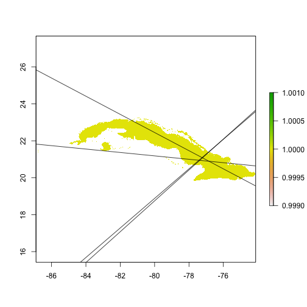
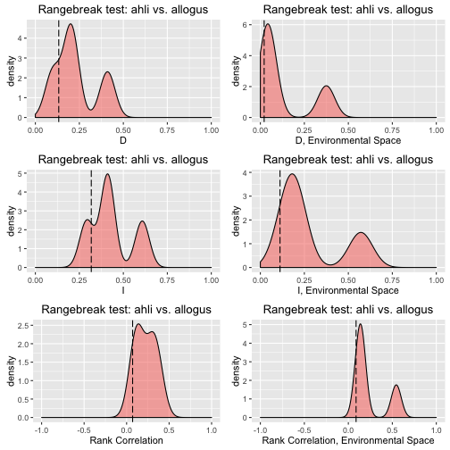
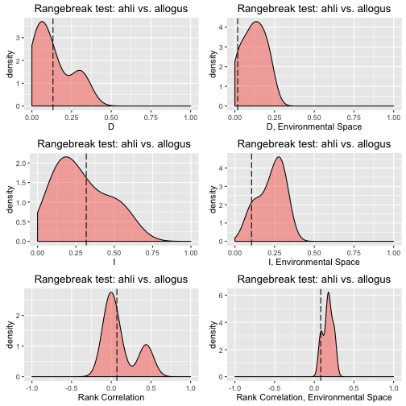
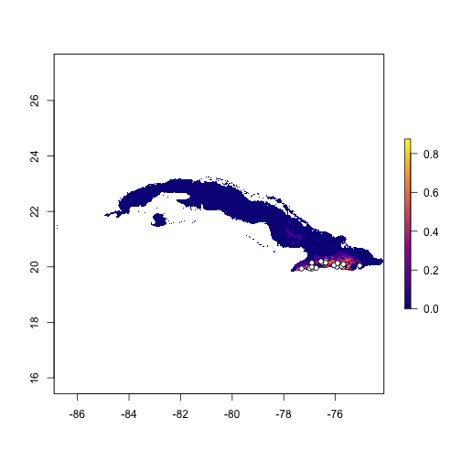
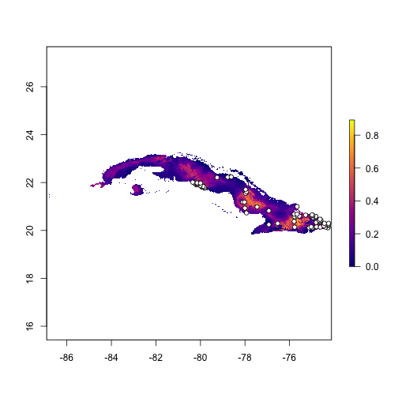
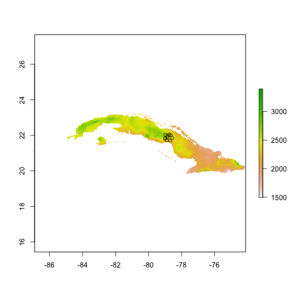
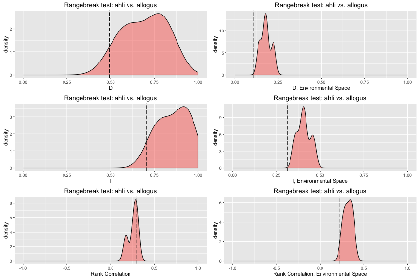
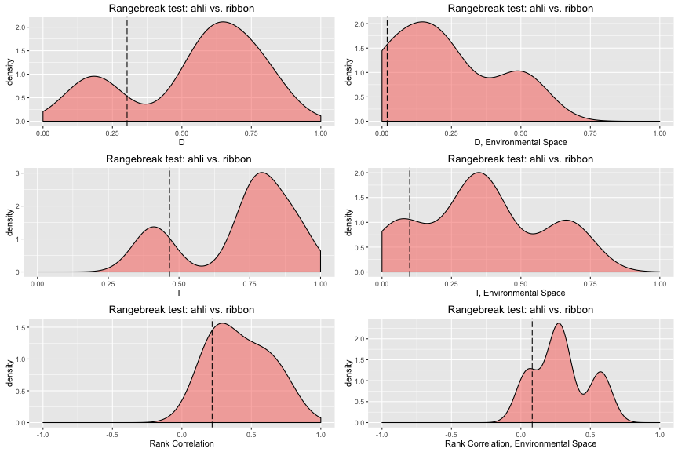
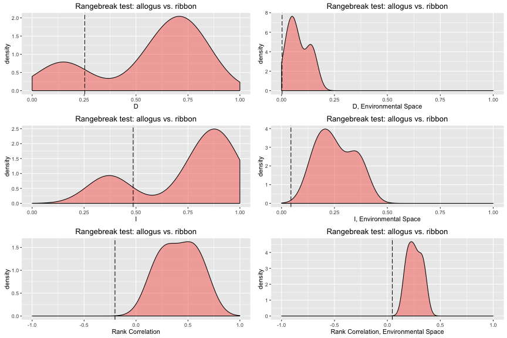
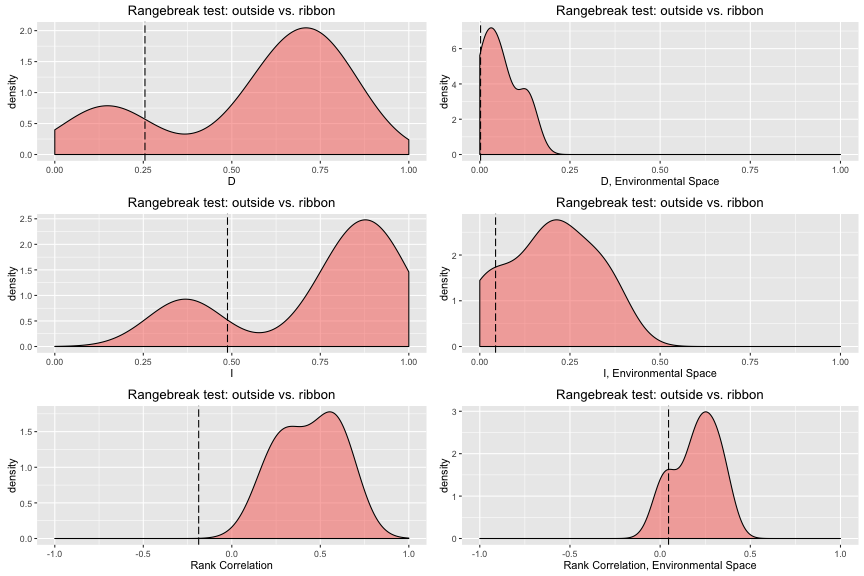

ENMTools
======================
This package implements various tests, visualizations, and metrics for use with environmental niche models (ENMs) and species distribution models (SDMs). 

-----

# Installation

At present, ENMTools is downloadable from https://github.com/danlwarren/ENMTools.  There are multiple ways to download it.  The easiest is to use devtools and install from GitHub.

### Installing from GitHub using devtools
Run the following code from your R console:


```r
install.packages("devtools")
library(devtools)
install_github("danlwarren/ENMTools")
library(ENMTools)
```

### Install from zip file

A zipped version of the package is available at https://github.com/danlwarren/ENMTools/archive/master.zip.  To install from the zip file, download a copy of it to your system.  Once it's finished downloading, type the following (where PATH is the path to the zip file):


```r
install.packages("devtools")
library(devtools)
install_local("PATH")
library(ENMTools)
```


-----


# Interacting with ENMTools

### Creating enmtools.species objects

First we're going to load in some environmental data.

```r
env.files <- list.files(path = "test/testdata/", pattern = "pc", full.names = TRUE)
env <- stack(env.files)
names(env) <- c("layer.1", "layer.2", "layer.3", "layer.4")
env <- setMinMax(env)
```

ENMTools is primarily designed to examine patterns of similarity and difference between ENMs for different species.  In order to simplify interactions with the functions in ENMTools, you need to put your data for each of your species into an enmtools.species object.  You can create and view an empty enmtools.species object just by typing:


```r
ahli <- enmtools.species()
ahli
```

```
## 
## 
## Range raster not defined.
## 
## Presence points not defined.
## 
## Background points not defined.
## 
## Species name not defined.
```

You can add data to this object manually:

```r
names(ahli)
```

```
## [1] "range"             "presence.points"   "background.points"
## [4] "models"            "species.name"
```

```r
ahli$species.name <- "ahli"
ahli$presence.points <- read.csv("test/testdata/ahli.csv")[,3:4]
ahli$range <- background.raster.buffer(ahli$presence.points, 50000, mask = env)
ahli$background.points <- background.points.buffer(points = ahli$presence.points,
                                                   radius = 20000, n = 1000, mask = env[[1]])

ahli
```

```
## 
## 
## Range raster: 
## class       : RasterLayer 
## dimensions  : 418, 1535, 641630  (nrow, ncol, ncell)
## resolution  : 0.008333333, 0.008333333  (x, y)
## extent      : -86.90809, -74.11642, 19.80837, 23.2917  (xmin, xmax, ymin, ymax)
## coord. ref. : NA 
## data source : in memory
## names       : layer.1 
## values      : 1, 1  (min, max)
## 
## 
## 
## Presence points (first ten only): 
## 
## | Longitude| Latitude|
## |---------:|--------:|
## |  -80.0106|  21.8744|
## |  -79.9086|  21.8095|
## |  -79.8065|  21.7631|
## |  -79.8251|  21.8095|
## |  -79.8807|  21.8374|
## |  -79.9550|  21.8374|
## |  -80.3446|  22.0136|
## |  -80.2983|  21.9951|
## |  -80.1776|  21.9023|
## |  -80.1591|  21.9673|
## 
## 
## Background points (first ten only): 
## 
## | Longitude| Latitude|
## |---------:|--------:|
## | -80.17059| 22.00420|
## | -79.84559| 22.07920|
## | -79.99559| 22.12920|
## | -79.74559| 21.81254|
## | -80.16226| 22.11254|
## | -80.32059| 22.16254|
## | -80.20392| 21.92920|
## | -80.36226| 22.02087|
## | -80.30392| 22.03754|
## | -80.19559| 22.11254|
## 
## 
## Species name:  ahli
```


Or you can add bits of it when the object is created:

```r
allogus <- enmtools.species(species.name = "allogus", 
                            presence.points = read.csv("test/testdata/allogus.csv")[,3:4])

allogus$range <- background.raster.buffer(allogus$presence.points, 50000, mask = env)
allogus$background.points <- background.points.buffer(points = allogus$presence.points,
                                                      radius = 20000, n = 1000, mask = env[[1]])

allogus
```

```
## 
## 
## Range raster: 
## class       : RasterLayer 
## dimensions  : 418, 1535, 641630  (nrow, ncol, ncell)
## resolution  : 0.008333333, 0.008333333  (x, y)
## extent      : -86.90809, -74.11642, 19.80837, 23.2917  (xmin, xmax, ymin, ymax)
## coord. ref. : NA 
## data source : in memory
## names       : layer.1 
## values      : 1, 1  (min, max)
## 
## 
## 
## Presence points (first ten only): 
## 
## | Longitude| Latitude|
## |---------:|--------:|
## |  -79.2527|  22.2109|
## |  -78.7774|  22.2241|
## |  -78.6189|  22.2373|
## |  -78.1039|  21.1809|
## |  -78.0247|  21.1809|
## |  -77.9983|  20.9301|
## |  -77.9719|  21.7091|
## |  -77.9719|  21.5507|
## |  -77.9323|  21.6167|
## |  -77.9323|  20.7320|
## 
## 
## Background points (first ten only): 
## 
## | Longitude| Latitude|
## |---------:|--------:|
## | -75.12059| 20.22087|
## | -74.17059| 20.17920|
## | -77.60392| 20.98754|
## | -74.65392| 20.26254|
## | -75.72059| 20.07087|
## | -77.32059| 19.92920|
## | -79.27892| 22.20420|
## | -79.12059| 22.21254|
## | -75.92892| 20.05420|
## | -75.13726| 20.28754|
## 
## 
## Species name:  allogus
```


## Building an ENM

ENMTools contains functions to simplify the ENM construction process.  Using enmtools.species objects and the correct modeling commands, we can build models very quickly.  These commands are primarily wrappers to dismo model construction and projection functions, and at present are only available for GLM, Maxent, Domain, and Bioclim models.  One of the nice bits about this setup is that it allows enmtools to automatically generate suitability maps, do model evaluation, and plot the marginal suitability of habitat for each variable separately.

### GLM

GLMs require the user to supply a formula, an enmtools.species object, and some environmental data.

```r
ahli.glm <- enmtools.glm(f = pres ~ layer.1 + layer.2 + layer.3 + layer.4, species = ahli, env = env, test.prop = 0.2)
```

```
## Adding environmental data to species ahli 
## 	Processing presence points...
## 	Processing background points...
```

```r
allogus.glm <- enmtools.glm(pres ~ layer.1 + layer.2 + layer.3 + layer.4, allogus, env, test.prop = 0.2)
```

```
## Adding environmental data to species allogus 
## 	Processing presence points...
## 	Processing background points...
```

```r
ahli.glm
```

```
## 
## 
## Formula:  presence ~ layer.1 + layer.2 + layer.3 + layer.4
## <environment: 0x119d52e68>
## 
## 
## Data table (top ten lines): 
## 
## |   | Longitude| Latitude| layer.1| layer.2| layer.3| layer.4| presence|
## |:--|---------:|--------:|-------:|-------:|-------:|-------:|--------:|
## |2  |  -79.9086|  21.8095|    2289|    1732|     957|     231|        1|
## |3  |  -79.8065|  21.7631|    2158|    1870|     983|     253|        1|
## |5  |  -79.8807|  21.8374|    2244|    1828|     945|     249|        1|
## |7  |  -80.3446|  22.0136|    2201|    1822|     978|     277|        1|
## |8  |  -80.2983|  21.9951|    2214|    1786|     986|     284|        1|
## |9  |  -80.1776|  21.9023|    2287|    1722|     992|     266|        1|
## |11 |  -80.1498|  21.9858|    3042|     841|    1371|     221|        1|
## |12 |  -80.1220|  21.9301|    2898|    1033|    1231|     242|        1|
## |13 |  -80.1776|  21.9673|    2914|    1020|    1256|     237|        1|
## |14 |  -80.2148|  21.9394|    2329|    1692|    1018|     269|        1|
## 
## 
## Model:  
## Call:
## glm(formula = f, family = "binomial", data = analysis.df[, -c(1, 
##     2)])
## 
## Deviance Residuals: 
##     Min       1Q   Median       3Q      Max  
## -0.5530  -0.1753  -0.1151  -0.0726   3.2771  
## 
## Coefficients:
##               Estimate Std. Error z value Pr(>|z|)  
## (Intercept) 65.2268474 29.4258911   2.217   0.0266 *
## layer.1     -0.0184552  0.0076199  -2.422   0.0154 *
## layer.2     -0.0182533  0.0078998  -2.311   0.0209 *
## layer.3      0.0004392  0.0073779   0.060   0.9525  
## layer.4      0.0151550  0.0243141   0.623   0.5331  
## ---
## Signif. codes:  0 '***' 0.001 '**' 0.01 '*' 0.05 '.' 0.1 ' ' 1
## 
## (Dispersion parameter for binomial family taken to be 1)
## 
##     Null deviance: 130.29  on 1011  degrees of freedom
## Residual deviance: 117.32  on 1007  degrees of freedom
## AIC: 127.32
## 
## Number of Fisher Scoring iterations: 8
## 
## 
## 
## Model fit (training data):  class          : ModelEvaluation 
## n presences    : 12 
## n absences     : 1000 
## AUC            : 0.7826667 
## cor            : 0.1024696 
## max TPR+TNR at : -4.11615 
## 
## 
## Proportion of data wittheld for model fitting:  0.2
## 
## Model fit (test data):  class          : ModelEvaluation 
## n presences    : 4 
## n absences     : 1000 
## AUC            : 0.682625 
## cor            : 0.03799521 
## max TPR+TNR at : -5.415436 
## 
## 
## Suitability:  
## class       : RasterLayer 
## dimensions  : 418, 1535, 641630  (nrow, ncol, ncell)
## resolution  : 0.008333333, 0.008333333  (x, y)
## extent      : -86.90809, -74.11642, 19.80837, 23.2917  (xmin, xmax, ymin, ymax)
## coord. ref. : NA 
## data source : in memory
## names       : layer 
## values      : 4.763821e-07, 0.9999995  (min, max)
```


To check out the marginal response functions, you only need to type


```r
ahli.glm$response.plots
```

```
## $layer.1
```


```
## 
## $layer.2
```


```
## 
## $layer.3
```


```
## 
## $layer.4
```


### Bioclim, Domain, and Maxent

The procedure for building Bioclim, Domain, and Maxent models is similar to the procedure for GLMs, with the exception that you do not need to pass a formula to the model function.  Note that running Maxent models requires a bit of extra setup; see dismo documentation for details.


```r
ahli.dm <- enmtools.dm(ahli, env, test.prop = 0.2)
ahli.bc <- enmtools.bc(ahli, env, test.prop = 0.2)
ahli.mx <- enmtools.maxent(ahli, env, test.prop = 0.2)
```


## Metrics: breadth, correlation, and overlap

ENMTools provides a number of metrics for ENMs and for similarities between ENMs.  These include measures of niche breadth, based on Levins(1968).  An important caveat when interpreting these metrics is that they are driven to some (variable) extent by the availability of different combinations of environmental variables.  As such they are more accurately interpreted as a measurment of the smoothness of the geographic distribution of suitability scores than as an estimate of the breadth of the fundamental niche; an orgamism with narrow fundamental niche breadth that nonetheless encompasses a set of environmental conditions that is quite common will have a high breadth when measured using ENMs, while having a low breadth in environment space.


```r
raster.breadth(ahli.glm)
```

```
## $B1
## [1] 0.3067042
## 
## $B2
## [1] 0.9060981
```


ENMTools also provides metrics for measuring similarity between ENMs.  These include Schoener's D (Schoener 1968), I (Warren et al. 2008), and the Spearman rank correlation coefficient between two rasters.  While D and I are commonly used in the ENM literature, they may tend to overestimate similarity between ENMs when many grid cells are of similar values (e.g., when two species prefer different habitat but the region contains a great deal of habitat that is unsuitable for both).  


```r
raster.overlap(ahli.glm, allogus.glm)
```

```
## $D
## [1] 0.5689994
## 
## $I
## [1] 0.7952055
## 
## $rank.cor
## [1] 0.9553947
```


A new feature of the R version of ENMTools is that you can now use these same metrics in the n-dimensional space of all combinations of environmental variables, instead of restricting your measures of model similarity to those sets of conditions that appear in the training region.  This is done by repeatedly drawing Latin hypercube samples from the space of all possible combinations of environmental variables given the min and max of each variable within the training region.  ENMTools continues to draw samples until subsequent iterations differ by less than a specified tolerance value.  Lower tolerance values result in more precise estimates of overlap, but can take much longer to calculate.


```r
env.overlap(ahli.glm, allogus.glm, env, tolerance = .001)
```

```
## $env.D
## [1] 0.6926854
## 
## $env.I
## [1] 0.9201649
## 
## $env.cor
## [1] 0.8945938
```

## Hypothesis testing

### Niche identity or equivalency test

In this example, we will run a niche identity (also called equivalency) test, as in Warren et al. 2008.  This test takes the presence points for a pair of species and randomly reassigns them to each species, then builds ENMs for these randomized occurrences.  By doing this many times, we can estimate the probability distribution for ENM overlap between species under the null hypothesis that the two species' occurrences in the environment are effectively a random draw from the same underlying distribution.  Note that niche evolution is only one of many reasons why two species' realized environmental distributions might cause departures from this null hypothesis.  See Warren et al. 2014 for details.

To run an identity test, we need to decide what type of models we will build, how many replicates we will run, and (in the case of GLM) a model formula to use for empirical models and the Monte Carlo replicates.  The resulting object contains the replicate models, p values, and plots of the results.  Typically idenity tests are run with at least 99 replicates, but we are using a smaller number here for the sake of execution time.

_NOTE:_ In order for models to be comparable, both empirical and pseudoreplicate models for the identity test are conducted with pseudoabsence points pooled for the two species being compared.


```r
id.glm <- identity.test(species.1 = ahli, species.2 = allogus, env = env, type = "glm", f = presence ~ layer.1 + layer.2 + layer.3 + layer.4, nreps = 4)
```


```r
id.glm
```

```
## 
## 
##  
## 
## Identity test ahli vs. allogus
## 
## Identity test p-values:
##        D        I rank.cor    env.D    env.I  env.cor 
##      0.2      0.2      0.2      0.2      0.2      0.2 
## 
## 
## Replicates:
## 
## 
## |          |         D|         I|   rank.cor|     env.D|     env.I|    env.cor|
## |:---------|---------:|---------:|----------:|---------:|---------:|----------:|
## |empirical | 0.2350003| 0.4808447| -0.4553754| 0.0045740| 0.0297154| -0.6178146|
## |rep 1     | 0.7344564| 0.9469428|  0.7388079| 0.5884393| 0.8598666|  0.6831496|
## |rep 2     | 0.7246363| 0.9466047|  0.6842447| 0.5409459| 0.8222905|  0.6490556|
## |rep 3     | 0.6967085| 0.9333026| -0.1674302| 0.4400421| 0.7394563|  0.1621624|
## |rep 4     | 0.7844410| 0.9647587|  0.8364008| 0.6910991| 0.9103467|  0.8158895|
```


### Background or similarity test

The background or similarity test compares the overlap seen between two species' ENMs to the overlap expected by chance if one or both species was effectively choosing habitat at random from within their broad geographic range.  The purpose of this test is to correct for the availability of habitat and ask whether the observed similarity between species or populations is significantly more (or less) than expected given the available set of environments in the regions in which they occur.  

_NOTE:_ In order for models to be comparable, both empirical and pseudoreplicate models for the background test are conducted with pseudoabsence points pooled for the two species being compared.

In Warren et al. 2008, we developed this test in the context of comparing one species' actual occurrence to the random background occurrences of the other species.  This is what we call an "asymmetric" test, and in our case we did the test in both directions with the idea that we might compare the results of A vs. B background to the results of B vs. A background.  This may be informative in some cases, but many people have also found this asymmetry confusing (and indeed it is often difficult to interpret).  For that reason, the background test here can be conducted against a null hypothesis that is generated from "asymmetric" (species.1 vs species.2 background) or "symmetric" (species.1 background vs. species.2 background) comparisons.

Here, for instance, is a Bioclim background test using the classical asymmetric approach:


```r
bg.bc.asym <- background.test(species.1 = ahli, species.2 = allogus, env = env, type = "bc", nreps = 4, test.type = "asymmetric" )
```


```r
bg.bc.asym
```

```
## 
## 
##  
## 
## Asymmetric background test ahli vs. allogus background
## 
## background test p-values:
##        D        I rank.cor    env.D    env.I  env.cor 
##      0.2      0.2      0.2      0.2      0.2      0.2 
## 
## 
## Replicates:
## 
## 
## |          |         D|         I|  rank.cor|     env.D|     env.I|   env.cor|
## |:---------|---------:|---------:|---------:|---------:|---------:|---------:|
## |empirical | 0.1328502| 0.3177390| 0.0706201| 0.0198339| 0.1080022| 0.0842038|
## |rep 1     | 0.1660104| 0.3586759| 0.1909027| 0.0558710| 0.2148477| 0.1976647|
## |rep 2     | 0.1592211| 0.3607542| 0.1840365| 0.0451324| 0.1858139| 0.1257972|
## |rep 3     | 0.1615904| 0.3574508| 0.1949963| 0.0261810| 0.1494302| 0.1069351|
## |rep 4     | 0.1634261| 0.3625374| 0.2018041| 0.0430571| 0.1781302| 0.1256006|
```


And here is a Domain background test using the symmetric approach:


```r
bg.dm.sym <- background.test(species.1 = ahli, species.2 = allogus, env = env, type = "dm", nreps = 4, test.type = "symmetric" )
```


```r
bg.dm.sym
```

```
## 
## 
##  
## 
## Symmetric background test ahli background vs. allogus background
## 
## background test p-values:
##        D        I rank.cor    env.D    env.I  env.cor 
##      0.2      0.2      0.2      0.4      0.4      0.2 
## 
## 
## Replicates:
## 
## 
## |          |         D|         I|  rank.cor|     env.D|     env.I|   env.cor|
## |:---------|---------:|---------:|---------:|---------:|---------:|---------:|
## |empirical | 0.4929334| 0.7052122| 0.2916150| 0.1084802| 0.3125128| 0.2263782|
## |rep 1     | 0.9581864| 0.9984085| 0.7669685| 0.7920627| 0.9345891| 0.8766337|
## |rep 2     | 0.7984298| 0.9316773| 0.6334356| 0.1406818| 0.3582536| 0.3735529|
## |rep 3     | 0.6937012| 0.8626153| 0.5785495| 0.0591034| 0.2279963| 0.2333123|
## |rep 4     | 0.9587405| 0.9975023| 0.8255787| 0.5476976| 0.7520892| 0.7323233|
```


### Rangebreak tests

ENMTools also allows you to perform linear, blob, and ribbon rangebreak tests as developed in Glor and Warren 2011.  The linear and blob tests are two versions of a test that permit one to ask whether the geographic regions occupied by two species are more environmentally different than expected by chance. The ribbon test, meanwhile, is designed to test whether the ranges of two species are divided by a region that is relatively unsuitable to one or both forms. 

For the linear and blob tests, you call them very much like you would the identity and background tests.  Here's a linear one using GLM models:

```r
rbl.glm <- rangebreak.linear(ahli, allogus, env, type = "bc", f = pres ~ layer.1 + layer.2 + layer.3 + layer.4, nreps = 4)
```

```
## 
## Building empirical models...
## 
## Building replicate models...
## 
## Replicate 1 ...
## 
## Replicate 2 ...
## 
## Replicate 3 ...
## 
## Replicate 4 ...
```

```r
rbl.glm
```

```
## 
## 
##  
## 
## Linear rangebreak test ahli vs. allogus
## 
## rangebreak test p-values:
##        D        I rank.cor    env.D    env.I  env.cor 
##      0.4      0.4      0.2      0.2      0.2      0.2 
## 
## 
## Replicates:
## 
## 
## |          |         D|         I|  rank.cor|     env.D|     env.I|   env.cor|
## |:---------|---------:|---------:|---------:|---------:|---------:|---------:|
## |empirical | 0.1328502| 0.3177390| 0.0706201| 0.0215592| 0.1115865| 0.0879468|
## |rep 1     | 0.1987358| 0.4108750| 0.2887518| 0.0540964| 0.2170998| 0.1509248|
## |rep 2     | 0.2082121| 0.4115158| 0.1022970| 0.0323838| 0.1361494| 0.1129015|
## |rep 3     | 0.0987945| 0.2918083| 0.1347988| 0.3748632| 0.5713065| 0.5447928|
## |rep 4     | 0.4099437| 0.6077530| 0.3617355| 0.0410778| 0.1851087| 0.1462710|
```




And here's a blob test using Bioclim:

```r
rbb.bc <- rangebreak.blob(ahli, allogus, env, type = "bc", nreps = 4)
```

```
## 
## Building empirical models...
## 
## Building replicate models...
## 
## Replicate 1 ...
## 
## Replicate 2 ...
## 
## Replicate 3 ...
## 
## Replicate 4 ...
```

```r
rbb.bc
```

```
## 
## 
##  
## 
## blob rangebreak test ahli vs. allogus
## 
## rangebreak test p-values:
##        D        I rank.cor    env.D    env.I  env.cor 
##      0.8      0.8      0.8      0.2      0.2      0.2 
## 
## 
## Replicates:
## 
## 
## |          |         D|         I|   rank.cor|     env.D|     env.I|   env.cor|
## |:---------|---------:|---------:|----------:|---------:|---------:|---------:|
## |empirical | 0.1328502| 0.3177390|  0.0706201| 0.0175996| 0.1048320| 0.0813781|
## |rep 1     | 0.3065088| 0.5296572|  0.4389944| 0.0945467| 0.2870306| 0.1887939|
## |rep 2     | 0.0327940| 0.1544608| -0.0172882| 0.2090513| 0.2986171| 0.2506776|
## |rep 3     | 0.1328502| 0.3177390|  0.0706201| 0.0210586| 0.1111126| 0.0839596|
## |rep 4     | 0.0510136| 0.1459824| -0.0452539| 0.1478220| 0.2144679| 0.1641411|
```




If you want to access the individual replicates (for instance to see how your ranges are being split up), you can find them in the list named "replicate.models" inside your rangebreak test object.

```r
rbl.glm$replicate.models$ahli.rep.1
```

```
## 
## 
## Data table (top ten lines): 
## 
## |   | Longitude| Latitude|
## |:--|---------:|--------:|
## |28 |  -77.3117|  19.9397|
## |32 |  -76.9155|  19.9397|
## |29 |  -76.9948|  19.9529|
## |35 |  -76.7439|  19.9661|
## |33 |  -76.9155|  20.0058|
## |41 |  -75.9384|  20.0058|
## |48 |  -75.7140|  19.9926|
## |40 |  -76.0573|  20.0586|
## |47 |  -75.7536|  20.0322|
## |34 |  -76.9155|  20.1510|
## 
## 
## Model:  class    : Bioclim 
## 
## variables: layer.1 layer.2 layer.3 layer.4 
## 
## 
## presence points: 16 
##    layer.1 layer.2 layer.3 layer.4
## 1     1909    1460    1018     267
## 2     1883    1541     973     289
## 3     2252    1018    1136     237
## 4     2069    1366    1004     279
## 5     2379     893    1197     222
## 6     1916    1557     856     360
## 7     1850    1596     842     343
## 8     2234    1255    1034     259
## 9     1854    1566     828     333
## 10    2050    1573     894     237
##   (... ...  ...)
## 
## 
## 
## Model fit (training data):  class          : ModelEvaluation 
## n presences    : 16 
## n absences     : 2000 
## AUC            : 0.927375 
## cor            : 0.1992092 
## max TPR+TNR at : 0.0104 
## 
## 
## Proportion of data wittheld for model fitting:  0
## 
## Model fit (test data):  [1] NA
## 
## 
## Suitability:  
## class       : RasterLayer 
## dimensions  : 418, 1535, 641630  (nrow, ncol, ncell)
## resolution  : 0.008333333, 0.008333333  (x, y)
## extent      : -86.90809, -74.11642, 19.80837, 23.2917  (xmin, xmax, ymin, ymax)
## coord. ref. : NA 
## data source : in memory
## names       : layer 
## values      : 0, 0.875  (min, max)
```



```r
rbl.glm$replicate.models$allogus.rep.1
```

```
## 
## 
## Data table (top ten lines): 
## 
## |   | Longitude| Latitude|
## |:--|---------:|--------:|
## |31 |  -76.9288|  20.2434|
## |46 |  -75.7668|  20.1378|
## |55 |  -75.1198|  20.1114|
## |60 |  -74.9745|  20.1114|
## |57 |  -75.0273|  20.1510|
## |37 |  -76.5326|  20.2963|
## |66 |  -74.7897|  20.1510|
## |70 |  -74.6180|  20.1378|
## |76 |  -74.2747|  20.1114|
## |74 |  -74.3803|  20.1378|
## 
## 
## Model:  class    : Bioclim 
## 
## variables: layer.1 layer.2 layer.3 layer.4 
## 
## 
## presence points: 65 
##    layer.1 layer.2 layer.3 layer.4
## 1     2085    1646     809     223
## 2     2100    1494     897     281
## 3     1748    1782     957     332
## 4     2018    1467    1012     355
## 5     2022    1563     972     330
## 6     2107    1601     947     257
## 7     2178    1302     975     464
## 8     2173    1157    1082     452
## 9     1972    1243    1112     422
## 10    2060    1291     918     503
##   (... ...  ...)
## 
## 
## 
## Model fit (training data):  class          : ModelEvaluation 
## n presences    : 65 
## n absences     : 3000 
## AUC            : 0.4851205 
## cor            : -0.009406275 
## max TPR+TNR at : 0.01442308 
## 
## 
## Proportion of data wittheld for model fitting:  0
## 
## Model fit (test data):  [1] NA
## 
## 
## Suitability:  
## class       : RasterLayer 
## dimensions  : 418, 1535, 641630  (nrow, ncol, ncell)
## resolution  : 0.008333333, 0.008333333  (x, y)
## extent      : -86.90809, -74.11642, 19.80837, 23.2917  (xmin, xmax, ymin, ymax)
## coord. ref. : NA 
## data source : in memory
## names       : layer 
## values      : 0, 0.8923077  (min, max)
```




For the ribbon rangebreak test, you will need one extra thing; a third enmtools.species object representing the occurrence points (for one or both species) that fall within the ribbon of putatively unsuitable habitat.  In the case of these two anoles we don't have such a ribbon, so we'll just simulate one based on some random points.


```r
ribbon <- enmtools.species(species.name = "ribbon")
ribbon$presence.points <- data.frame(Longitude = runif(n = 10, min = -79, max = -78.5),
                                      Latitude = runif(n = 10, min = 21.7, max = 22.1))
plot(env[[1]])
points(ribbon$presence.points)
```



```r
ribbon$range <- background.raster.buffer(ribbon$presence.points, 20000, mask = env)
ribbon
```

```
## 
## 
## Range raster: 
## class       : RasterLayer 
## dimensions  : 418, 1535, 641630  (nrow, ncol, ncell)
## resolution  : 0.008333333, 0.008333333  (x, y)
## extent      : -86.90809, -74.11642, 19.80837, 23.2917  (xmin, xmax, ymin, ymax)
## coord. ref. : NA 
## data source : in memory
## names       : layer.1 
## values      : 1, 1  (min, max)
## 
## 
## 
## Presence points (first ten only): 
## 
## | Longitude| Latitude|
## |---------:|--------:|
## | -78.98416| 22.02770|
## | -78.99294| 21.83354|
## | -78.56214| 21.86387|
## | -78.85903| 21.90616|
## | -78.69981| 21.70282|
## | -78.74202| 22.04184|
## | -78.99934| 21.81669|
## | -78.65836| 21.99941|
## | -78.89545| 21.72497|
## | -78.83499| 21.98824|
## 
## 
## Background points not defined.
## 
## Species name:  ribbon
```


Now we'll run a ribbon rangebreak test using Domain models.  We also need to tell it the width of the ribbons to generate for the replicates.  The units for the width argument are the same units that the presence points are in; e.g., if the points are in decimal degrees you should supply the width of the barrier in decimal degrees. 

```r
rbr <- rangebreak.ribbon(ahli, allogus, ribbon, env, type = "dm", width = 0.5, nreps = 4)
```

```
## 
## 
## No background points provided, drawing background from range raster.
```

```
## Warning in couldBeLonLat(mask): CRS is NA. Assuming it is longitude/
## latitude
```

```
## 
## Building empirical models...
## 
## Building replicate models...
## 
## Replicate 1 ...
## 
## Replicate 2 ...
## 
## Replicate 3 ...
## 
## Replicate 4 ...
```

```r
rbr
```

```
## 
## 
##  
## 
## ribbon rangebreak test ahli vs. allogus
## 
## rangebreak test p-values...
## 
## Species 1 vs. Species 2:
##        D        I rank.cor    env.D    env.I  env.cor 
##      0.2      0.2      0.8      0.2      0.2      0.2 
## 
## Species 1 vs. Ribbon:
##        D        I rank.cor    env.D    env.I  env.cor 
##      0.4      0.4      0.2      0.4      0.4      0.4 
## 
## Species 2 vs. Ribbon:
##        D        I rank.cor    env.D    env.I  env.cor 
##      0.4      0.4      0.2       NA       NA       NA 
## 
## Outside vs. Ribbon:
##        D        I rank.cor    env.D    env.I  env.cor 
##      0.4      0.4      0.2      0.4      0.4      0.4 
## 
## 
## Replicates:
## 
## Species 1 vs. Species 2:
##                   D         I  rank.cor     env.D     env.I   env.cor
## empirical 0.4929334 0.7052122 0.2916150 0.1086680 0.3133709 0.2283189
## rep 1     0.7871887 0.9350626 0.2581460 0.1822737 0.4114688 0.3751010
## rep 2     0.6389256 0.8211175 0.2890371 0.1734793 0.3991223 0.2994483
## rep 3     0.5480594 0.7490748 0.3040259 0.1406326 0.3591187 0.2582168
## rep 4     0.8021616 0.9346452 0.1740911 0.2229552 0.4588575 0.3434222
## 
## Species 1 vs. Ribbon:
##                   D         I  rank.cor       env.D      env.I    env.cor
## empirical 0.3027098 0.4664090 0.2177441 0.018703535 0.09968491 0.08164329
## rep 1     0.5737771 0.7621358 0.2207434 0.137609097 0.32360596 0.25501207
## rep 2     0.7828068 0.9072692 0.6897382 0.499799481 0.66732491 0.57388456
## rep 3     0.6474121 0.7874128 0.4924585 0.235220708 0.37667275 0.29557654
## rep 4     0.1832910 0.4108599 0.2666880 0.005503739 0.06633967 0.04710293
## 
## Species 2 vs. Ribbon:
##                   D         I   rank.cor       env.D      env.I    env.cor
## empirical 0.2531664 0.4862291 -0.2026288 0.002313288 0.04442566 0.04648023
## rep 1     0.6040282 0.7989113  0.6277620 0.032043500 0.16611369 0.18517449
## rep 2     0.7670893 0.9194360  0.5035220 0.141069146 0.35939082 0.33491176
## rep 3     0.7302912 0.8966632  0.1918323 0.066764332 0.24093630 0.25342646
## rep 4     0.1492609 0.3708396  0.3277892          NA         NA         NA
## 
## Outside vs. Ribbon:
##                   D         I   rank.cor        env.D      env.I
## empirical 0.2547006 0.4878103 -0.1871757 0.0021827197 0.04379100
## rep 1     0.6058381 0.7995688  0.6047375 0.0314759503 0.16556781
## rep 2     0.7675130 0.9201855  0.5660251 0.1321183554 0.34769293
## rep 3     0.7317293 0.8978461  0.2273583 0.0645323320 0.23663670
## rep 4     0.1480335 0.3690275  0.3475506 0.0008094841 0.02557274
##              env.cor
## empirical 0.04667924
## rep 1     0.18185786
## rep 2     0.33861382
## rep 3     0.25616007
## rep 4     0.02778483
```



```
## Warning: Removed 1 rows containing non-finite values (stat_density).
```

```
## Warning: Removed 1 rows containing non-finite values (stat_density).

## Warning: Removed 1 rows containing non-finite values (stat_density).
```


Note that the output table here has slope, intercept, and intercept offset.  The intercept denotes the intercept corresponding to the CENTER of the ribbon.  To get the lines denoting the edges of the ribbons (for example if you want to plot the ribbons on a map), you add and substract the offset.  In other words, the top edge of the ribbon is given by y = (slope * x) + intercept + offset, while the bottom edge is given by y = (slope * x) + intercept - offset.  


### Literature cited


*Levins, R. 1968. Evolution In Changing Environments. Monographs in Population Biology, volume 2. Princeton University Press, Princeton, New Jersey, USA.*

*Schoener, T. W. 1968. Anolis lizards of Bimini: resource partitioning in a complex fauna. Ecology 49:704- 726.*

*Warren, D.L., R.E. Glor, and M. Turelli.  2008. Environmental niche identity versus conservatism: quantitative approaches to niche evolution.  Evolution 62:2868-2883. doi: 10.1111/j.1558-5646.2008.00482.x*

*Warren, D.L., M. Cardillo, D.F. Rosauer, and D.I. Bolnick. 2014. Mistaking geography for biology: inferring processes from species distributions. Trends in Ecology and Evolution 29 (10), 572-580. doi: 10.1016/j.tree.2014.08.003*
