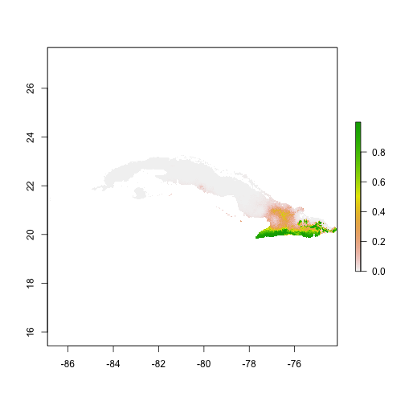

ENMTools
======================
This package implements various tests, visualizations, and metrics for use with environmental niche models (ENMs) and species distribution models (SDMs). 

-----

# Installation

At present, ENMTools is downloadable from https://github.com/danlwarren/ENMTools.  There are multiple ways to download it.  The easiest is to use devtools and install from GitHub.

### Installing from GitHub using devtools
Run the following code from your R console:


```r
install.packages("devtools")
library(devtools)
install_github("danlwarren/ENMTools")
library(ENMTools)
```

### Install from zip file

A zipped version of the package is available at https://github.com/danlwarren/RWTY/archive/master.zip.  To install from the zip file, download a copy of it to your system.  Once it's finished downloading, type the following (where PATH is the path to the zip file):


```r
install.packages("devtools")
library(devtools)
install_local("PATH")
library(ENMTools)
```


-----


# Interacting with ENMTools

### Creating enmtools.species objects

First we're going to load in some environmental data.

```r
env.files <- list.files(path = "test/testdata/", pattern = "pc", full.names = TRUE)
env <- stack(env.files)
```

ENMTools is primarily designed to examine patterns of similarity and difference between ENMs for different species.  In order to simplify interactions with the functions in ENMTools, you need to put your data for each of your species into an enmtools.species object.  You can create and view an empty enmtools.species object just by typing:


```r
ahli <- enmtools.species()
ahli
```

```
## 
## 
## Range raster not defined.
## 
## Presence points not defined.
## 
## Background points not defined.
## 
## Species name not defined.
```

You can add data to this object manually:

```r
names(ahli)
```

```
## [1] "range"             "presence.points"   "background.points"
## [4] "models"            "species.name"
```

```r
ahli$species.name <- "ahli"
ahli$presence.points <- read.csv("test/testdata/ahli.csv")[,3:4]
ahli$range <- background.raster.buffer(ahli$presence.points, 50000, mask = env)
ahli$background.points <- background.points.buffer(points = ahli$presence.points,
                                                   radius = 20000, n = 1000, mask = env[[1]])

ahli
```

```
## 
## 
## Range raster: 
## class       : RasterLayer 
## dimensions  : 418, 1535, 641630  (nrow, ncol, ncell)
## resolution  : 0.008333333, 0.008333333  (x, y)
## extent      : -86.90809, -74.11642, 19.80837, 23.2917  (xmin, xmax, ymin, ymax)
## coord. ref. : NA 
## data source : in memory
## names       : layer.1 
## values      : 1, 1  (min, max)
## 
## 
## 
## Presence points (first ten only): 
## 
## | Longitude| Latitude|
## |---------:|--------:|
## |  -80.0106|  21.8744|
## |  -79.9086|  21.8095|
## |  -79.8065|  21.7631|
## |  -79.8251|  21.8095|
## |  -79.8807|  21.8374|
## |  -79.9550|  21.8374|
## |  -80.3446|  22.0136|
## |  -80.2983|  21.9951|
## |  -80.1776|  21.9023|
## |  -80.1591|  21.9673|
## 
## 
## Background points (first ten only): 
## 
## | Longitude| Latitude|
## |---------:|--------:|
## | -80.26226| 22.03754|
## | -80.31226| 22.12920|
## | -79.86226| 21.85420|
## | -79.99559| 21.86254|
## | -80.07892| 21.95420|
## | -79.63726| 21.71254|
## | -79.67059| 21.81254|
## | -79.79559| 21.85420|
## | -80.27059| 21.90420|
## | -80.12059| 22.15420|
## 
## 
## Species name:  ahli
```


Or you can add bits of it when the object is created:

```r
allogus <- enmtools.species(species.name = "allogus", 
                            presence.points = read.csv("test/testdata/allogus.csv")[,3:4])

allogus$range <- background.raster.buffer(allogus$presence.points, 50000, mask = env)
allogus$background.points <- background.points.buffer(points = allogus$presence.points,
                                                      radius = 20000, n = 1000, mask = env[[1]])

allogus
```

```
## 
## 
## Range raster: 
## class       : RasterLayer 
## dimensions  : 418, 1535, 641630  (nrow, ncol, ncell)
## resolution  : 0.008333333, 0.008333333  (x, y)
## extent      : -86.90809, -74.11642, 19.80837, 23.2917  (xmin, xmax, ymin, ymax)
## coord. ref. : NA 
## data source : in memory
## names       : layer.1 
## values      : 1, 1  (min, max)
## 
## 
## 
## Presence points (first ten only): 
## 
## | Longitude| Latitude|
## |---------:|--------:|
## |  -79.2527|  22.2109|
## |  -78.7774|  22.2241|
## |  -78.6189|  22.2373|
## |  -78.1039|  21.1809|
## |  -78.0247|  21.1809|
## |  -77.9983|  20.9301|
## |  -77.9719|  21.7091|
## |  -77.9719|  21.5507|
## |  -77.9323|  21.6167|
## |  -77.9323|  20.7320|
## 
## 
## Background points (first ten only): 
## 
## | Longitude| Latitude|
## |---------:|--------:|
## | -76.98726| 20.70420|
## | -77.63726| 20.93754|
## | -78.50392| 22.09587|
## | -74.93726| 20.57920|
## | -78.90392| 22.22087|
## | -76.52059| 20.39587|
## | -78.12892| 21.81254|
## | -78.88726| 22.32087|
## | -74.15392| 20.22087|
## | -75.12892| 20.48754|
## 
## 
## Species name:  allogus
```


## Building an ENM

ENMTools contains functions to simplify the ENM construction process.  Using enmtools.species objects and the corrected modeling commands, we can build models very quickly.  These commands are primarily wrappers to dismo model construction and projection functions, and at present are only available for GLM, Maxent, Domain, and Bioclim models.

### GLM

GLMs require the user to supply a formula, an enmtools.species object, and some environmental data.

```r
ahli.glm <- enmtools.glm(pres ~ layer.1 + layer.2 + layer.3 + layer.4, ahli, env)
```

```
## Adding environmental data to species ahli 
## 	Processing presence points...
## 	Processing background points...
```

```r
print(ahli.glm)
```

```
## 
## 
## Formula:  presence ~ layer.1 + layer.2 + layer.3 + layer.4
## <environment: 0x11cd9e318>
## 
## 
## Data table (top ten lines): 
## 
## | layer.1| layer.2| layer.3| layer.4| presence|
## |-------:|-------:|-------:|-------:|--------:|
## |    2765|    1235|    1174|     252|        1|
## |    2289|    1732|     957|     231|        1|
## |    2158|    1870|     983|     253|        1|
## |    2207|    1877|     967|     259|        1|
## |    2244|    1828|     945|     249|        1|
## |    2250|    1766|     919|     235|        1|
## |    2201|    1822|     978|     277|        1|
## |    2214|    1786|     986|     284|        1|
## |    2287|    1722|     992|     266|        1|
## |    2984|     965|    1311|     237|        1|
## 
## 
## Model:  
## Call:
## glm(formula = f, family = "binomial", data = analysis.df)
## 
## Deviance Residuals: 
##      Min        1Q    Median        3Q       Max  
## -0.53920  -0.20427  -0.14098  -0.09313   3.10858  
## 
## Coefficients:
##              Estimate Std. Error z value Pr(>|z|)  
## (Intercept) 50.002411  24.145553   2.071   0.0384 *
## layer.1     -0.013693   0.006192  -2.211   0.0270 *
## layer.2     -0.013122   0.006478  -2.026   0.0428 *
## layer.3      0.001374   0.006309   0.218   0.8276  
## layer.4     -0.005035   0.021949  -0.229   0.8185  
## ---
## Signif. codes:  0 '***' 0.001 '**' 0.01 '*' 0.05 '.' 0.1 ' ' 1
## 
## (Dispersion parameter for binomial family taken to be 1)
## 
##     Null deviance: 164.58  on 1015  degrees of freedom
## Residual deviance: 150.29  on 1011  degrees of freedom
## AIC: 160.29
## 
## Number of Fisher Scoring iterations: 8
## 
## 
## 
## Suitability:  
## class       : RasterLayer 
## dimensions  : 418, 1535, 641630  (nrow, ncol, ncell)
## resolution  : 0.008333333, 0.008333333  (x, y)
## extent      : -86.90809, -74.11642, 19.80837, 23.2917  (xmin, xmax, ymin, ymax)
## coord. ref. : NA 
## data source : in memory
## names       : layer 
## values      : -12.95668, 10.96518  (min, max)
```



### Bioclim, Domain, and Maxent

The procedure for building Bioclim, Domain, and Maxent models is similar to the procedure for GLMs, with the exception that you do not need to pass a formula to the model function.  Note that running Maxent models requires a bit of extra setup; see dismo documentation for details.


```r
ahli.dm <- enmtools.dm(ahli, env)
ahli.bc <- enmtools.bc(ahli, env)
ahli.mx <- enmtools.maxent(ahli, env)
```

```
## Error in .jcheck(silent = TRUE): No running JVM detected. Maybe .jinit() would help.
```

