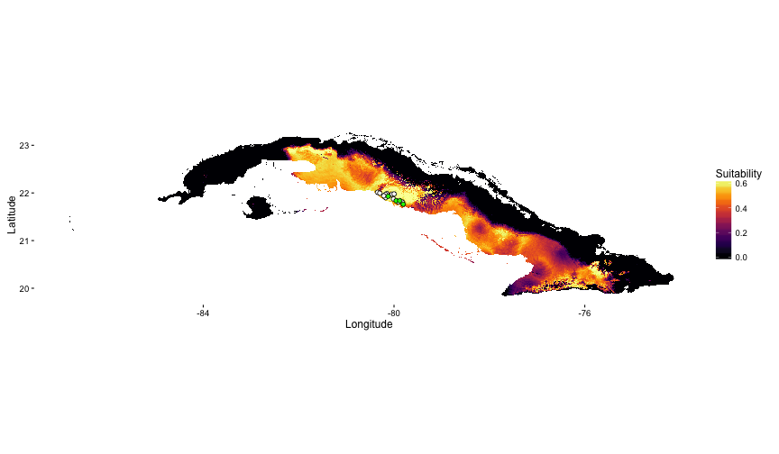
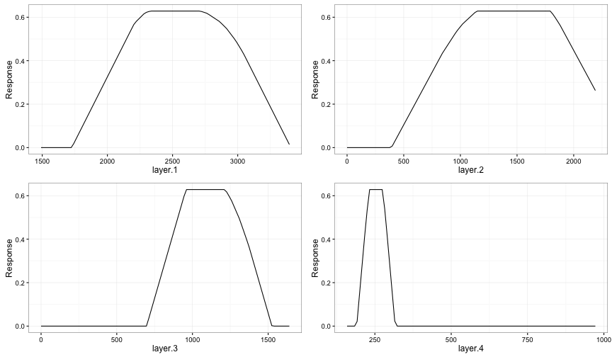
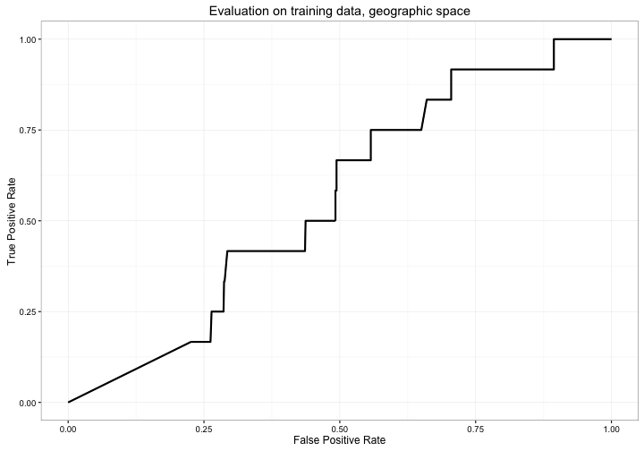
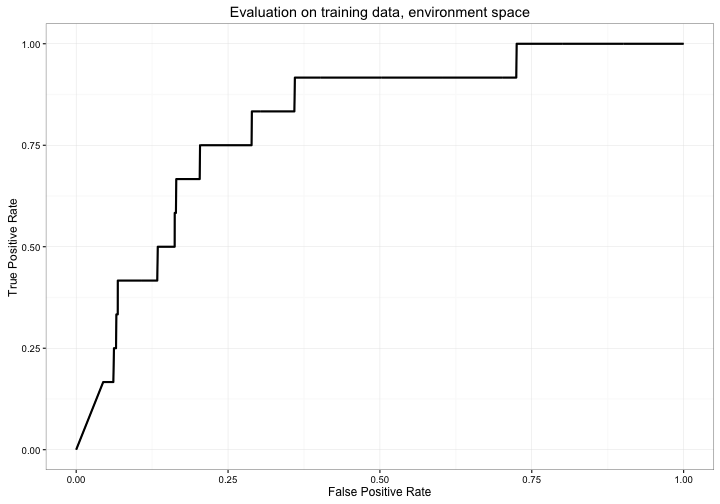
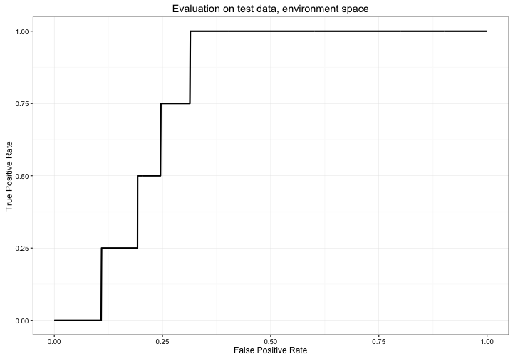
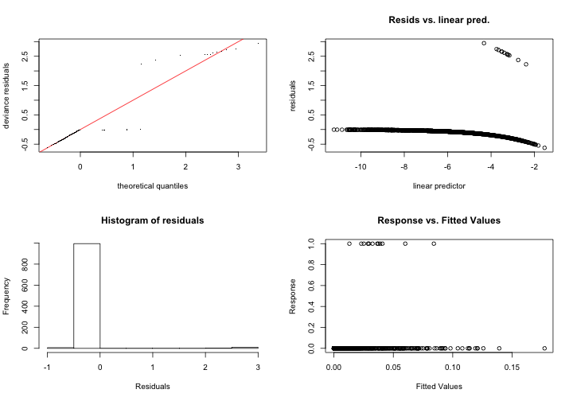
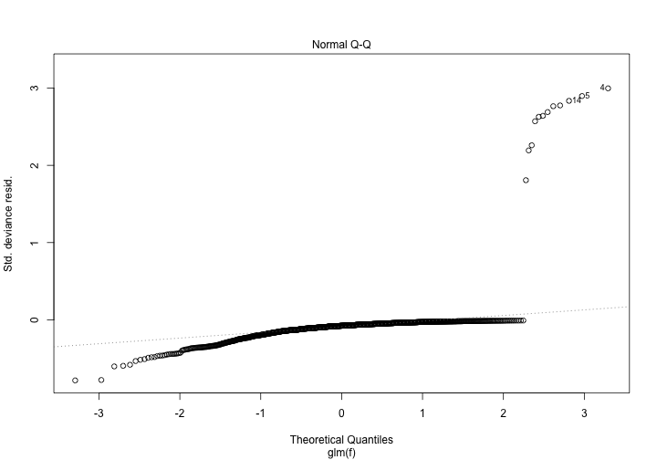
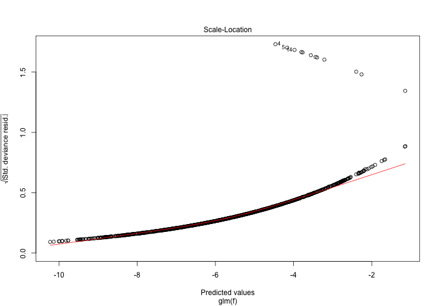
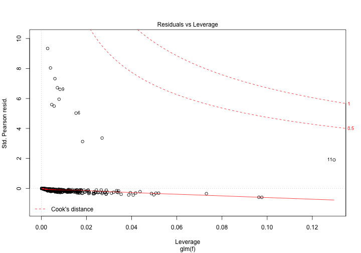

# Summary of ENMTools GLM object for ahli

## Spatial prediction

<br>
<br>
<br>
<br>
<br>
<br>
<br>

## Model: presence ~ layer.1 + layer.2 + layer.3 + layer.4


```
## 
## Call:
## glm(formula = f, family = "binomial", data = analysis.df[, -c(1, 
##     2)])
## 
## Deviance Residuals: 
##      Min        1Q    Median        3Q       Max  
## -0.74488  -0.13883  -0.07665  -0.04069   2.99231  
## 
## Coefficients:
##              Estimate Std. Error z value Pr(>|z|)  
## (Intercept) 51.160755  25.044454   2.043   0.0411 *
## layer.1     -0.013078   0.006203  -2.108   0.0350 *
## layer.2     -0.011998   0.007070  -1.697   0.0897 .
## layer.3      0.002176   0.006837   0.318   0.7503  
## layer.4     -0.024502   0.029418  -0.833   0.4049  
## ---
## Signif. codes:  0 '***' 0.001 '**' 0.01 '*' 0.05 '.' 0.1 ' ' 1
## 
## (Dispersion parameter for binomial family taken to be 1)
## 
##     Null deviance: 130.29  on 1011  degrees of freedom
## Residual deviance: 103.98  on 1007  degrees of freedom
## AIC: 113.98
## 
## Number of Fisher Scoring iterations: 9
```
<br>
<br>
<br>
<br>
<br>
<br>

## Evaluation
### Geographic space


```
## class          : ModelEvaluation 
## n presences    : 12 
## n absences     : 1000 
## AUC            : 0.89175 
## cor            : 0.1522184 
## max TPR+TNR at : -4.465634
```
<br>
<br>

```
## 
## 
## Proportion of data wittheld for model testing:
```

```
## [1] 0.2
```


```
## class          : ModelEvaluation 
## n presences    : 4 
## n absences     : 1000 
## AUC            : 0.885 
## cor            : 0.08461102 
## max TPR+TNR at : -4.144371
```
<br>
<br>
<br>
<br>

### Environment space


```
## class          : ModelEvaluation 
## n presences    : 12 
## n absences     : 10000 
## AUC            : 0.5042417 
## cor            : -0.0213783 
## max TPR+TNR at : 0.01126784
```
<br>

```
## 
## 
## Proportion of data wittheld for model testing:
```

```
## [1] 0.2
```



```
## class          : ModelEvaluation 
## n presences    : 4 
## n absences     : 10000 
## AUC            : 0.49635 
## cor            : -0.01302775 
## max TPR+TNR at : 0.01556609
```
<br>
<br>
<br>
<br>

## Model fit

<br>
<br>
<br>
<br>

# Notes

```
## [1] "None"
```
<br>
<br>
<br>
<br>

# Citations
Warren, D.L. (2016) Package ‘enmtools’. Available online at: https://github.com/danlwarren/ENMTools

Hijmans, R.J, Phillips, S., Leathwick, J. and Elith, J. (2011), Package ‘dismo’. Available online at: http://cran.r-project.org/web/packages/dismo/index.html.
